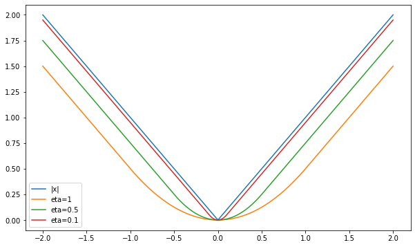

We continue our endeavor of looking for a practical and efficient implementation of the stochastic proximal point method, which aims to minimize the average loss $$\frac{1}{n} \sum_{i=1}^n f_i(x)$$ over $$n$$ training samples by, iteratively,  selecting  $$f \in \{f_1, \dots, f_n \}$$ and computing


$$
x_{t+1} = \operatorname*{argmin}_x \{ f(x) + \frac{1}{2\eta} \|x - x_t\|_2^2 \}.
$$


Recall, the challenge lies in the fact that  $$f$$ can be arbitrary complex, and thus computing $$x_{t+1}$$ can be arbitrarily hard, and may even be impossible. A major benefit, on the othet hand, is stability w.r.t step-size choices, compared with black-box stochastic gradient methods.

In the previous post we derived, implemented, and tested an efficient implementation for a specific family of losses of the form


$$
f(x)=\phi(a^T x + b),
$$


where $$\phi$$ is a convex function, which include linear least squares, and logistic regression. In this post we add a _convex_ regularizer $$r(x)$$, and discuss losses of the following form:


$$
f(x)=\phi(a^T x + b) + r(x).
$$


For example, consider an L2 regularized least-squares problem:


$$
\min_x \quad \frac{1}{2 n} \sum_{i=1}^n (a_i^T x + b)^2 + \frac{\lambda}{2} \|x\|_2^2.
$$


The above problem is an instance of regularized convex-on-linear losses with $$\phi(t)=\frac{1}{2} t^2$$ and $$r(x) = \frac{\lambda}{2} \|x\|_2^2$$, both are known to be convex.

# L2 regularization

Suppose that $$r(x)=\lambda \|x\|_2^2$$, namely, we may consider an L2 regularized least squares or an L2 regularized logistic regression problem. Let’s repeat the steps we have done in the previous post, and see if we obtain similar results - decoupling a ‘generic’ optimizer from some minimal user-provided knowledge about $$\phi$$. 

We could like to compute $$x_{t+1}$$ by solving the following problem using convex duality theory:


$$
x_{t+1} = \operatorname{argmin}_{x} \left\{ \phi(a^T x + b) + \frac{\lambda}{2} \|x\|_2^2+\frac{1}{2\eta} \|x - x_t\|_2^2 \right\}.
$$


Defining the auxiliary variable $$u = a^T x + b$$, we obtain the problem of minimizing the following over $$x$$ and $$u$$:


$$
\phi(u)+ \frac{\lambda}{2} \|x\|_2^2+\frac{1}{2\eta} \|x - x_t\|_2^2 \qquad \text{s.t.} \qquad u = a^T x + b.
$$


The corresponding dual problem aims to maximize


$$ {Dual function}
\begin{align}
q(s) 
 &= \inf_{x,u} \left \{ \phi(u)+ \frac{\lambda}{2} \|x\|_2^2+\frac{1}{2\eta} \|x - x_t\|_2^2 + s(a^T x + b - u) \right \} \\
 &= \color{blue}{ \inf_x \left \{ \frac{\lambda}{2} \|x\|_2^2+\frac{1}{2\eta} \|x - x_t\|_2^2 + s a^T x \right \}} + \color{red}{\inf_u \left\{ \phi(u) - s u \right\}} + s b
\end{align}
$$


Recalling our previous cost, the red part is $$-\phi^*(s)$$, where $$\phi^*$$ is the _convex conjugate function_ of $$\phi$$. The blue part is a simple quadratic minimization problem, which can be solved by equating the gradient of the term inside the $$\inf$$ with zero. We save the tedious math, and state only the final results. The minimizer is


$$
x = \frac{1}{1 + \lambda \eta} (x_t - \eta s a),
$$


and the minimum is

 

$$
-\frac{\eta \|a\|_2^2}{2(1+\lambda \eta)} s^2 + \frac{a^T u}{1 + \lambda \eta} s + CONST
$$


where $$CONST$$ are terms which do not depend on $$s$$ and thus we don’t care what they are. Thus, the dual problem aims to maximize the following one-dimensional function (up to a constant):


$$
q(s)=-\frac{\eta \|a\|_2^2}{2(1+\lambda \eta)} s^2 + \left[\frac{a^T u}{1 + \lambda \eta} + b \right] s - \phi^*(s).
$$


Viola! We arrived at the expected result, and reduced the problem of computing $$x_{t+1}$$ to a simple one-dimensional problem which depends only on $$\phi$$. The corresponding  “generic” algorithm for computing $$x_{t+1}$$ is:

1. Compute the coefficients of $$q(s)$$, namely, $$\alpha = \frac{\eta \|a\|_2^2}{1+\lambda \eta}$$ and $$\beta = \left[\frac{a^T u}{1 + \lambda \eta} + b \right]$$.
2. Find a maximizer $$s^*$$ of  $$q(s)=-\frac{\alpha}{2} s^2 + \beta s - \phi^*(s)$$.
3. Compute $$x_{t+1} = \frac{1}{1 + \lambda \eta} (x_t - \eta s^* a)$$

Now let’s face reality: steps (1) and (3) which should be performed by a ‘generic’ optimizer are not generic at all - they heavily depend on our regularizer $$r(x)=\frac{\lambda}{2} \|x\|_2^2$$! In fact, the regularizer is deeply integrated in all computational steps - given a different regularizer, steps (1) and (3) can be radically different from the above.  

Unfortunately, we cannot decouple the regularizer with ease, but we can still hide it behind some well-known textbook concept which can be found by a practitioner wishing to write an stochastic proximal point optimizer. 

# High-school tricks

Repeating the dual problem derivation with a generic regularizer $$r(x)$$ instead of the L2 regularizer, we obtain 


$$
q(s)=\color{blue}{\inf_x \left \{ \mathcal{Q}(x) = r(x)+\frac{1}{2\eta} \|x-x_t\|_2^2 + s a^T x \right \}} - \phi^*(s)+sb
$$


Now, let’s employ a simple trick we learnt in high school - completing a square. Recall, that


$$
\frac{1}{2}\|a + b\|_2^2= \frac{1}{2}\|a\|_2^2+a^T b+\frac{1}{2}\|b\|_2^2,
$$


and re-arranging, we obtain


$$
\frac{1}{2}\|a\|_2^2+a^T b = \frac{1}{2}\|a + b\|_2^2 - \frac{1}{2}\|b\|_2^2.
$$


Now, let’s apply the trick to the term inside the blue infimum above. It is a bit technical, but the end-result leads us to our texbook recipe.


$$
\begin{align}
\mathcal{Q}(x) &= r(x)+\frac{1}{2\eta} \|x-x_t\|_2^2 + s a^T x \\
 &= \frac{1}{\eta} \left[ \eta r(x) +  \frac{1}{2} \|x - x_t\|_2^2 + \eta s a^T x \right] & \leftarrow \text{Factoring out  } \frac{1}{\eta} \\
 &= \frac{1}{\eta} \left[ \eta r(x) + \color{orange}{\frac{1}{2} \|x\|_2^2 - (x_t - \eta s a )^T x} + \frac{1}{2} \|x_t\|_2^2 \right] & \leftarrow \text{opening } \frac{1}{2}\|x-x_t\|_2^2 \\
 &= \frac{1}{\eta} \left[ \eta  r(x) + \color{orange}{\frac{1}{2} \|x - (x_t - \eta s a)\|_2^2 - \frac{1}{2} \|\eta s a - x_t\|_2^2 } + \frac{1}{2} \|x_t\|_2^2 \right] & \leftarrow \text{square completion}\\
 &= \left[ r(x)+\frac{1}{2\eta} \|x_t - \eta s a)\|_2^2  \right] - \frac{1}{2\eta} \|x_t + \eta s a\|_2^2 +  \underbrace{\frac{1}{2\eta} \|x_t\|_2^2}_{\text{CONST}}
\end{align}
$$


With the above in mind, the dual problem becomes:


$$
q(s)= \color{magenta}{ \inf_x \left \{ r(x)+\frac{1}{2\eta} \| x - (x_t - \eta s a)\|_2^2 \right \}} - \phi^*(s)+ s b - \frac{1}{2 \eta} \|x_t + \eta s a\|_2^2 + \mathrm{CONST}
$$


It may seem unfamiliar, but the magenta term is a well-known concept in optimization: the Moreau envelope[^menv] of the function $$r(x)$$. 

# Moreau envelopes

Moreau envelopes, which were introduced in 1965 by the French mathematician Jean-Jack Moreau, is an operator which “smoothes” arbitrary convex functions. The Moreau envelope of a convex function $$r$$ with parameter $$\eta$$ is defined by


$$
E_{\eta}r(u) = \inf_x \left\{ r(x) + \frac{1}{2\eta} \|x - u\|_2^2 \right\}.
$$


Before going deeper, let's point out that the magenta term in $$q(s)$$  above is exactly $$E_{\eta} r(x_t - \eta s a)$$. 


To make things less abstract, and look at a one-dimensional example to gain some more intuition. Suppose that $$r(x) = |x|$$. Doing some calculus which is out of scope of this post, we can compute:


$$
E_{\eta}r (u) = \inf_x \left\{ |x| + \frac{1}{2\eta}(x - u)^2\right\} = \begin{cases}
\frac{u^2}{2\eta} & |u| \leq \eta \\
|u| - \frac{\eta}{2} & |u|>\eta
\end{cases}
$$


That is, the envelope is a function which looks like a prabola when $$u$$ is close enough to the origin, and ’switches’ to behaving like the absolute value when we get far away. Some of you may recognize it - this is the Huber function. Let’s plot it:

```python
import numpy as np
import matplotlib.pyplot as plt
import math

def huber_1d(eta, u):
    if math.fabs(u) <= eta:
        return (u ** 2) / (2 * eta)
    else:
        return math.fabs(u) - eta / 2
    
def huber(eta, u):
    return np.array([huber_1d(eta, x) for x in u])

x = np.linspace(-2, 2, 1000)
plt.plot(x, np.abs(x), label='|x|')
plt.plot(x, huber(1, x), label='eta=1')
plt.plot(x, huber(0.5, x), label='eta=0.5')
plt.plot(x, huber(0.1, x), label='eta=0.1')
plt.legend(loc='best')
plt.show()
```

Here is the resulting plot:



As expected, we got a smoothed version of the absolute value function. Smaller values of $$\eta$$ lead to a better, but less smooth approximation.


TODO: point to a catalog of moreau envelopes, show a few examples.


[^menv]: J-J Moreau. (1965). Proximite et dualit´e dans un espace Hilbertien. _Bulletin de la Société Mathématique de France 93._  (pp. 273–299)

