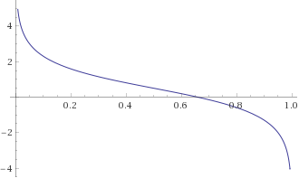

[Last time]({{ page.previous.url }}) we discussed applying the stochastic proximal point method 


$$
x_{t+1} = \operatorname*{argmin}_x \left\{ f(x) + \frac{1}{2\eta} \|x - x_t\|_2^2 \right\} \tag{S}
$$


 to losses of the form


$$
f(x)=\underbrace{\phi(a^T x + b)}_{\text{data fitting}} + \underbrace{r(x)}_{\text{regularizer}},
$$


where $$\phi$$ and $$r$$ are convex functions, and devised an efficient implementation for L2 regularized losses: $$r(x) = (\lambda/2) \|x\|_2^2$$.  We now aim for a more general approach, which will allow us to deal with many other regularizers. One important example is L1 regularization $$r(x)=\lambda \|x\|_1 = \sum_{i=1}^d \vert x_i \vert$$, since it is well-known that it promotes a _sparse_ parameter vector $$x$$. It is useful when we have a huge number of features, and the small number of non-zero components of $$x$$ select only the features which have meaningful effect on the model’s predictive power.

Recall that implementing stochastic proximal point method amounts to solving the one-dimensional problem dual to the optimizer’s step (S) by maximizing:


$$
q(s)=\color{blue}{\inf_x \left \{ \mathcal{Q}(x,s) = r(x)+\frac{1}{2\eta} \|x-x_t\|_2^2 + s a^T x \right \}} - \phi^*(s)+sb. \tag{A}
$$


Having obtained the maximizer $$s^*$$ we compute $$x_{t+1} = \operatorname*{argmin}_x \left\{ \mathcal{Q}(x,s^*)  \right\}$$. 

The part highlighted in blue is where the regularizer comes in, and is a major barrier between a practitioner and the method’s advantages - the practitioner has to mathematically re-derive the minimization of $$\mathcal{Q}(x,s)$$ and re-implement the resulting derivation for every regularizer.  Seems quite impractical, and since $$r(x)$$ can be arbitrarily complex, it might even be impossible. 

Unfortunately, we cannot remove this obstacle entirely, but we can express it in terms of a “textbook recipe” - something a practitioner can pick from a catalog in a textbook and use, instead of re-deriving. In fact, that’s how most optimization methods work. For example, SGD is based on the textbook recipe of ‘gradient’ and we have explicit rules for computing them,  the stochastic proximal point method we derived in the [last post]({{ page.previous.url }}) is based on the textbook recipe of ‘convex conjugate’, and in this post we will introduce and use yet another textbook recipe.

# High-school tricks

Our journey begins with one trick which is taught in high-school algebra classes is known as “completing a square” - we re-arrange the formula for a square of a sum $$(a+b)^2=a^2+2ab+b^2$$  to the form


$$
a^2+2ab=(a+b)^2-b^2.
$$


Such a trick is occasionally useful to express things in terms of squares only. We do a similar trick on the formula for the squared Euclidean norm:


$$
\frac{1}{2}\|a + b\|_2^2= \frac{1}{2}\|a\|_2^2+a^T b+\frac{1}{2}\|b\|_2^2. \tag{a}
$$


Re-arranging, we obtain


$$
\frac{1}{2}\|a\|_2^2+a^T b = \frac{1}{2}\|a + b\|_2^2 - \frac{1}{2}\|b\|_2^2. \tag{b}
$$


Now, let’s apply the trick to the term $$\mathcal{Q}(x,s)$$ inside the infimum in the definition of the dual problem. It is a bit technical, but the end-result leads us to our desired texbook recipe.


$$
\begin{align}
\mathcal{Q}(x,s) &= r(x)+\frac{1}{2\eta} \|x-x_t\|_2^2 + s a^T x \\
 &= \frac{1}{\eta} \left[ \eta r(x) +  \frac{1}{2} \|x - x_t\|_2^2 + \eta s a^T x \right] & \leftarrow \text{Factoring out  } \frac{1}{\eta} \\
 &= \frac{1}{\eta} \left[ \eta r(x) + \color{orange}{\frac{1}{2} \|x\|_2^2 - (x_t - \eta s a )^T x} + \frac{1}{2} \|x_t\|_2^2 \right] & \leftarrow \text{opening } \frac{1}{2}\|x-x_t\|_2^2 \text{with (a)} \\
 &= \frac{1}{\eta} \left[ \eta  r(x) + \color{orange}{\frac{1}{2} \|x - (x_t - \eta s a)\|_2^2 - \frac{1}{2} \|x_t - \eta s a\|_2^2 } + \frac{1}{2} \|x_t\|_2^2 \right] & \leftarrow \text{square completion with (b)}\\
 &= \left[ r(x)+\frac{1}{2\eta} \|x - (x_t - \eta s a)\|_2^2  \right] - \frac{1}{2\eta} \|x_t - \eta s a\|_2^2 + \frac{1}{2\eta} \|x_t\|_2^2  &\leftarrow{\text{Multiplying by }\frac{1}{\eta}} \\
 &= \left[ r(x)+\frac{1}{2\eta} \|x - (x_t - \eta s a)\|_2^2  \right] + (a^T x_t) s - \frac{\eta \|a\|_2^2}{2} s^2 &\leftarrow{\text{applying (a) and canceling terms}}
\end{align}
$$


Plugging the above expression for $$\mathcal{Q}(x,s)$$ into the formula (A), results in:


$$
q(s)= \color{magenta}{ \inf_x \left \{ r(x)+\frac{1}{2\eta} \| x - (x_t - \eta s a)\|_2^2 \right \}} + (a^T x_t + b) s - \frac{\eta \|a\|_2^2}{2} s^2  - \phi^*(s)
$$


The magenta part may seem unfamiliar, but it is a well-known concept in optimization: the Moreau envelope[^menv] of the function $$r(x)$$. Let’s get introduced to the concept properly.

Formally, the  Moreau envelope of a convex function $$r$$ with parameter $$\eta$$ is denoted by $$M_\eta r$$ and defined by


$$
M_\eta r(u) = \inf_x \left\{ r(x) + \frac{1}{2\eta} \|x - u\|_2^2 \right\}. \tag{c}
$$


Consequently, we can write  the function $$q(s)$$ of the dual problem as:


$$
q(s) = \color{magenta}{M_{\eta} r (x_t - \eta s a)} + (a^T x_t + b) s - \frac{\eta \|a\|_2^2}{2} s^2 - \phi^*(s).
$$


Now $$q(s)$$ is composed of two textbook concepts - the convex conjugate $$\phi^*$$, and the Moreau envelope $$M_\eta r$$. A related concept is the minimizer of (c) above - Moreau’s [proximal operator](https://en.wikipedia.org/wiki/Proximal_operator) of $$r$$ with parameter $$\eta$$:


$$
\operatorname{prox}_{\eta r}(u) = \operatorname*{argmin}_x \left\{ r(x)+\frac{1}{2\eta} \|x - u\|_2^2 \right\}.
$$


Moreau envelopes and proximal operators, which were introduced in 1965 by the French mathematician [Jean Jacques Moreau](https://en.wikipedia.org/wiki/Jean-Jacques_Moreau), create a  “smoothed” version of arbitrary convex functions, and are nowdays ubiquitous in modern optimization theory and practice. Since then, the concepts have been used for many other purposes - just [Google Scholar](https://scholar.google.com/scholar?q=Moreau+Envelope) it. In fact, the stochastic proximal point method itself can be compactly written in terms of the operator: select  $$f \in \{f_1, \dots, f_n\}$$ and compute $$x_{t+1} = \operatorname{prox}_{\eta f}(x_t)$$.

Before going deeper, let’s recap and explicitly write our “meta-algorithm" for computing $$x_{t+1}$$ using the above concepts:

1. Compute  $$q(s)$$ using the Moreau envelope.
2. Solve the dual problem: find a maximizer $$s^*$$ of $$q(s)$$.
3. Compute $$x_{t+1} = \operatorname{prox}_{\eta r}(x_t - \eta s^* a)$$.


# Moreau envelope - tangible example

To make things less abstract, look at a one-dimensional example to gain some more intuition:  the absolute value function $$r(x) = \lvert x \rvert$$. Doing some lengthy calculus, which is out of scope of this post, we can compute:


$$
M_{\eta}r (u) = \inf_x \left\{ \vert x \vert + \frac{1}{2\eta}(x - u)^2\right\} = \begin{cases}
\frac{u^2}{2\eta} & \mid u\mid \leq \eta \\
\vert u \vert - \frac{\eta}{2} & \vert u \vert>\eta
\end{cases}
$$


That is, the envelope is a function which looks like a prabola when $$u$$ is close enough to the 0, and switches to behaving like the absolute value when we get far away. Some readers may recognize this function - this is the well-known Huber function, which is commonly used in statistics as differentiable approximation of the absolute value. Let’s plot it:

```python
import numpy as np
import matplotlib.pyplot as plt
import math

def huber_1d(eta, u):
    if math.fabs(u) <= eta:
        return (u ** 2) / (2 * eta)
    else:
        return math.fabs(u) - eta / 2
    
def huber(eta, u):
    return np.array([huber_1d(eta, x) for x in u])

x = np.linspace(-2, 2, 1000)
plt.plot(x, np.abs(x), label='|x|')
plt.plot(x, huber(1, x), label='eta=1')
plt.plot(x, huber(0.5, x), label='eta=0.5')
plt.plot(x, huber(0.1, x), label='eta=0.1')
plt.legend(loc='best')
plt.show()
```

Here is the resulting plot:


Viola! A smoothed version of the absolute value function. Smaller values of $$\eta$$ lead to a better, but less smooth approximation. As we said before, this behavior is not unique to the absolute value’s envelope - Moreau envelopes of convex functions are _always_ differentiable, and their gradient is always continuous. 

Another interesting thing we can see in the plot is that the envelopes approach the approximating function from below. It is not a coincidence as well, since:


$$
M_\eta r(u) = \inf_x \left\{ r(x) + \frac{1}{2\eta} \|x - u\|_2^2 \right\} \underbrace{\leq}_{\text{taking }x=u} r(u)+\frac{1}{2\eta}\|u-u\|_2^2=r(u),
$$


that is, the envelope always lies below the function itself.

# Maximizing $$q(s)$$

Now let’s get back to our meta-algorithm. We need to solve the dual problem by maximizing $$q(s)$$, and we typically do it by equating its derivative $$q’(s)$$ with zero. Hence, in practice, we are interested in the _derivative_ of $$q$$ rather than its value (assuming $$q$$ is indeed continuously differentiable). Using the chain rule, we obtain:


$$
q'(s) = -\eta a^T ~\nabla M_\eta r(x_t - \eta s a) + (a^T x_t + b) - \eta \|a\|_2^2 s - {\phi^*}'(s). \tag{d}
$$


Moreau's exceptional work does not disappoint, and using some clever analysis he derived the following remarkable formula for the gradient of $$M_\eta r$$:


$$
\nabla M_\eta r(u) = \frac{1}{\eta} \left(u - \operatorname{prox}_{\eta r}(u) \right).
$$


Substituting the formula for into (d), the derivative $$q’(s)$$ can be written as


$$
\begin{aligned}
q'(s)
 &=-a^T(x_t - \eta s a - \operatorname{prox}_{\eta r}(x_t - \eta s a)) + (a^T x_t+b) - \eta \|a\|_2^2 s -{\phi^*}'(s) \\
 &= a^T \operatorname{prox}_{\eta r}(x_t - \eta s a) - {\phi^*}'(s) + b
\end{aligned} \tag{DD}
$$


To conclude, our ingredients for $$q’(s)$$ are: a formula for the proximal operator of $$r$$, and a formula for the derivative of $$\phi^*$$. Since proximal operators are ubiquitous in optimization theory and practice,  entire book chapters about proximal operators were written, i.e. see [here](https://web.stanford.edu/~boyd/papers/pdf/prox_algs.pdf)[^proxalgs] and [here](https://archive.siam.org/books/mo25/mo25_ch6.pdf)[^fom6]. The second reference contains, at the end of the chapter, a catalog of explicit formulas for $$\operatorname{prox}_{\eta r}$$ for various functions $$r$$  summarized in a table. Here are a two important examples:

| $$r(x)$$                                                  | $$\operatorname{prox}_{\eta r}(u)$$                          | Remarks                                                      |
| --------------------------------------------------------- | ------------------------------------------------------------ | ------------------------------------------------------------ |
| $$(\lambda/2) \|x\|_2^2$$                                 | $$\frac{1}{1+\eta \lambda} u$$                               |                                                              |
| $$\lambda \|x\|_1 = \lambda\sum_{i=1}^n \vert x_i \vert$$ | $$[\vert u \vert -\lambda \eta \mathbf{1}]_+ \cdot \operatorname{sign}(u)$$ | $$\mathbf{1}$$ is a vector whose components are all 1. $$[a]_+\equiv\max(0, a)$$ is the ‘positive part’ of $$a$$. More details later in this post. |
| 0                                                         | u                                                            | no regularizer                                               |

With the above in mind, the meta-algorithm for computing $$x_{t+1}$$ amounts to:

1. Obtain a solution $$s^*$$ of the equation $$q’(s)=a^T \operatorname{prox}_{\eta r}(x_t - \eta s a) - {\phi^*}'(s) + b = 0$$
2. Compute $$x_{t+1} = \operatorname{prox}_{\eta r}(x_t - \eta s^* a)$$

# L2 regularization - again

Last time we used a lengthy mathematical derivation to obtain  the computational steps for L2 regularized losses, namely, losses of the form


$$
f(x)=\phi(a^T x + b)+\underbrace{\frac{\lambda}{2} \|x\|_2^2}_{r(x)}.
$$


Let’s see if we can avoid lengthy and error-prone mathematics using the dual-derivative formula (DD).  According to the table of proximal operators, we have $$\operatorname{prox}_{\eta r}(u)=\frac{1}{1+\eta \lambda} u$$.  Thus, to compute $$s^*$$ we plug the above into the formula and solve:


$$
\begin{align}
q'(s)
 &=\frac{1}{1+\eta\lambda}a^T(x_t - \eta s a) - {\phi^*}'(s) + b \\
 &= \frac{a^T x_t}{1+\eta\lambda} + b -\frac{\eta \|a\|_2^2}{1+\eta\lambda} s -  {\phi^*}'(s) = 0
\end{align}
$$


Looking carefully, we see that it is exactly the derivative of $$q(s)$$ from the last post, but this time it was obtained by taking a formula from a textbook. No lengthy math this time!

Having obtained the solution of  $$s^*$$ of the equation $$q’(s)=0$$, we can proceed and compute


$$
x_{t+1}=\operatorname{prox}_{\eta r}(x_t - \eta s^* a) = \frac{1}{1+\eta\lambda}(x_t - \eta s^* a),
$$


which is, again, the same formula we obtained in the last post, but without doing any lengthy math.

The only thing a practitioner wishing to derive a formula for $$x_{t+1}$$ has to do by herself is to find a way to solve the one-dimensional equation $$q’(s)=0$$. The rest is provided by our textbook recipes - the proximal operator, and the convex conjugate.

# L1 regularized logistic regression - end to end optimizer tutorial

We consider losses of the form


$$
f(x)=\ln(1+\exp(a^T x)) + \lambda\|x\|_1,
$$


namely, $$\phi(t)=\ln(1+\exp(t))$$ and $$r(x)=\lambda \|x\|_1$$. The vector $$a$$ comprises both the training sample $$w$$ and the label $$y \in \{0, 1\}$$, since for a positive sample the incurred loss is $$\ln(1+\exp(-w^T x))$$, while for a negative sample the incurred loss is $$\ln(1+\exp(w^T x))$$. Namely, we have $$a = \pm w$$, where the sign depends on the label $$y$$. 

## Deriving and implementing the optimizer

We need to deal with two tasks: find $${\phi^*}’$$ and $$\operatorname{prox}_{\eta r}$$. In previous posts in the series we already saw that 


$$
\phi^*(s)=s \ln(s) + (1-s) \ln(1-s), \qquad 0 \ln(0) \equiv 0,
$$


and it is defined on the closed interval $$[0,1]$$. The derivative is


$$
{\phi^*}'(s)=\ln(s)-\ln(1-s),
$$


and it is defined on the open interval $$(0,1)$$. From the table of proximal operators above, we find that 


$$
\operatorname{prox}_{\eta r}(u) = [\mid u \mid -\lambda \eta \mathbf{1}]_+ \cdot \operatorname{sign}(u).
$$


The above formula may be familar to some of you with background in signal processing: this is the [soft-thresholding](https://en.wikipedia.org/wiki/Proximal_gradient_methods_for_learning#Lasso_regularization)  function $$S_\delta(u)$$ with $$\delta = \eta \lambda$$. It is implemented in PyTorch as `torch.nn.functional.softshrink`, while in NumPy it can be easily implemented as:

```python
import numpy as np

# the soft-thresholding function with parameter `delta`
def soft_threshold(delta, u):
	return np.clip(np.abs(u) - delta, 0, None) * np.sign(u)
```

Let's plot it for the one-dimensional case, to see what it looks like:

```python
import matplotlib.pyplot as plt
x = np.linspace(-5, 5, 1000)
plt.plot(x, soft_threshold(1, x), label='delta=1')
plt.plot(x, soft_threshold(3, x), label='delta=3')
plt.legend(loc='best')
plt.show()
```

Here is the result:


The function zeroes-out inputs close to the origin, and behaves as a linear function when our distance from the origin is $$\geq \delta$$. 

Now let’s discuss the implementation. Seems we have all our ingredients for the derivative formula (DD) - the proximal operator of $$r$$ and the derivative $${\phi^*}’$$. Putting the ingredients together, we aim to solve:


$$
q'(s)=a^T S_{\eta \lambda}(x_t - \eta s a)-\ln(s)+\ln(1-s)=0
$$


At first glance it seems like a hard equation to solve, but we have already dealt with a similar challenge in a previous post. Recall that:

1. The dual function $$q$$ is aways _concave_, and therefore its derivative $$q’$$ is _decreasing_. Moreover, it tends to infinity when $$s \to 1$$, and tends to negative infinity when $$s \to 0$$ . In other words, $$q’$$ looks something like this:
   
2. The function $$q’$$ is defined on the interval $$(0,1)$$ and is continuous. Thus, we can employ the same bisection strategy we used in a previous post for non-regularized logistic regression:
   1. Find an initial interval $$[l, u]$$  where our solution must lie, by setting:
      1.  $$l=2^{-k}$$ for the smallest positive integer $$k$$ satisfying $$q’(2^{-k}) > 0$$,
      2. and  $$u=1-2^{-k}$$ for the smallest positive integer $$k$$ satisfying $$q’(1-2^{-k}) < 0$$.
   2. Run the bisection method for finding a zero of $$q’(s)$$ in the interval $$[l, u]$$.

Finally, having solved the equaion $$q’(s)=0$$ we use its solution $$s^*$$ to compute:


$$
x_{t+1} = S_{\eta \lambda}(x_t - \eta s^* a)
$$


Let’s implement the method, and then discuss one of its important properties:

```python
import math
import torch
from torch.nn.functional import softshrink

class LogisticRegressionL1:
    def __init__(self, x, eta, lambdaa):
    	self._x = x
    	self._eta = eta
        self._lambda = lambdaa
        
    def step(self, w, y):
    # helper local variables
    delta = self._eta * self._lambda
    eta = self._eta
    x = self._x

    # extract vector `a` from features w and label y
    if y == 0:
      a = w
    else:
      a = -w

    # compute the incurred loss components
    data_loss = math.log1p(math.exp(torch.dot(a, x).item())) # logistic loss
    reg_loss = self._lambda * x.abs().sum().item().          # L1 regularization
    
    # dual derivative
    def qprime(s):
      return torch.dot(a, softshrink(x - eta * s * a, delta)).item() - math.log(s) + math.log(1 - s)
    
    # find initial bisection interval
    l = 0.5
    while qprime(l) <= 0:
      l /= 2
        
    u = 0.5
    while qprime(1 - u) >= 0:
      u /= 2
    u = 1 - u
        
    # run bisection - find s_star
    while u - l > 1E-16: # should be accurate enough
        mid = (u + l) / 2
        if qprime(mid) == 0:
            break
        if qprime(l) * qprime(mid) > 0:
            l = mid
        else:
            u = mid
    s_star = (u + l) / 2        
        
     # perform the computational step
    x.set_(softshrink(x - eta * s_star * a, delta))

    # return loss components
    return data_loss, reg_loss
```

Before running an experiment, let’s discuss an important property of our optimizer. Look at the last line in the code above - the next iterate $$x_{k+1}$$ is the result of the soft-thresholding operator, and we saw that it zeroes-out entries of $$x$$ whose absolute value is very small ($$\leq \eta\lambda$$). Consequently, the algorithm itself reflects the sparsity promoting nature of L1 regularization - we zero-out insignificant entries!

The above property is exactly the competitive edge of the proximal point approach in contrast to black-box approaches, such as SGD. Since we deal with the loss itself, rather with its first-order approximation, we preserve its important properties. As we will see in the experiment below, AdaGrad does not produce sparse vecotrs, while the solver we implemented above does. So even if we did not have the benefit of step-size stability, we still have the benefit of preserving our regularizer’s properties.

Since my computational resources are limited, and I do not wish to train models for several days, we will use a rather small data-set this time. I chose the spambase dataset available from [here](https://web.stanford.edu/~hastie/ElemStatLearn/data.html). It is composed of 48 numerical columns, signifying frequencies of various frequently-occuring words, and average run-lengths of capital letters, and a 49-th column with a spam indicator.

Let’s begin by loading the data-set

```python
import pandas as pd

url = 'https://web.stanford.edu/~hastie/ElemStatLearn/datasets/spam.data'
df = pd.read_csv(url, delimiter=' ', header=None)
df.sample(4)
```

Here is a possible result of the `sample` function, which samples 4 rows at random:

```
       0     1     2    3     4   ...     53      54   55    56  57
4192  0.0  0.00  0.00  0.0  0.00  ...  0.000   2.939   51    97   0
1524  0.0  0.90  0.00  0.0  0.00  ...  0.000   6.266   41    94   1
1181  0.0  0.00  0.00  0.0  1.20  ...  0.000  50.166  295   301   1
669   0.0  0.26  0.26  0.0  0.39  ...  0.889  12.454  107  1096   1
```

Now, let’s normalize all our numerical columns to lie in $$[0,1]$$, so that all our logistic regression coefficients we will be at the same scale (otherwise, L1 regularization will not be effective):

```python
from sklearn import preprocessing

min_max_scaler = preprocessing.MinMaxScaler()
scaled = min_max_scaler.fit_transform(df.iloc[:, 0:56])
df.iloc[:, 0:56] = scaled
```

Now, let’s create our PyTorch data-set, which we will use for training:

```python
from torch.utils.data.dataset import TensorDataset
W = torch.tensor(np.array(df.iloc[:, 0:56])) # features
Y = torch.tensor(np.array(df.iloc[:, 57]))   # labels
ds = TensorDataset(W, Y)
```

And now, let’s run the optimizer we wrote above, `LogisticRegressionL1`, to find the weights of the regularized logistic regression model, with regularization parameter $$\lambda=0.0003$$.  Since this post is on optimization, we refer readers to standard techniques for choosing regularization parameters, such as K-fold cross-validation. Since our proximal point optimizers are quite stable w.r.t the step size choices, I just chose $$\eta = 1$$, without doing too much thinking.

```python
from torch.utils.data.dataloader import DataLoader

# init. model parameter vector
x = torch.empty(56, requires_grad=False, dtype=torch.float64)
torch.nn.init.normal_(x)

# create optimizer
step_size = 1
llambda = 3E-4
opt = LogisticRegressionL1(x, step_size, llambda)

# run 40 epochs, print out data loss and reg. loss
for epoch in range(40):
  data_loss = 0.0
  reg_loss = 0.0
  for w, y in DataLoader(ds, shuffle=True):
    ww = w.squeeze(0)
    yy = y.item()
    step_data_loss, step_reg_loss = opt.step(ww, yy)
    data_loss += step_data_loss
    reg_loss += step_reg_loss
  print('data loss = ', data_loss / len(ds), 
        ' reg. loss = ', reg_loss / len(ds),
        ' loss = ', (data_loss + reg_loss) / len(ds))

# print the parameter vector
print(x)
```

Here is the output I got:

```
data loss =  0.3975306874061495  reg. loss =  0.036288109782517605  loss =  0.4338187971886671
data loss =  0.31726795987087547  reg. loss =  0.054970775631660425  loss =  0.3722387355025359
...
data loss =  0.26724176087574  reg. loss =  0.0789531172022866  loss =  0.34619487807802657
tensor([-2.2331e-01, -2.4050e+00, -1.9527e-01,  1.3942e-01,  2.5370e+00,
         1.3878e+00,  1.3516e+01,  2.6608e+00,  2.0741e+00,  1.7322e-01,
         1.6017e+00, -2.9143e+00, -2.9302e-01, -1.6100e-02,  2.1631e+00,
         1.1565e+01,  4.9527e+00,  1.7578e-01, -1.1546e+00,  3.2810e+00,
         1.6294e+00,  2.9166e+00,  1.1044e+01,  4.6498e+00, -3.0636e+01,
        -8.7392e+00, -2.6487e+01, -6.1895e-02, -1.3150e+00, -1.7103e+00,
         5.8073e-02,  0.0000e+00, -8.5150e+00,  0.0000e+00,  0.0000e+00,
        -1.4386e-02, -2.4498e+00,  0.0000e+00, -2.0155e+00, -6.6931e-01,
        -2.7988e+00, -1.3649e+01, -2.0991e+00, -7.5787e+00, -1.4172e+01,
        -1.9791e+01, -1.1263e+00, -2.6178e+00, -3.5694e+00, -6.1839e+00,
        -1.4704e+00,  5.4873e+00,  2.1276e+01,  0.0000e+00,  3.6687e-01,
         1.8539e+00], dtype=torch.float64)
```

After 40 epochs we got a parameter vector with several zero entries. These are the entries which our regularized optimization problem zeroes out, due to their small effect on model accuracy. Note, that increasing $$\lambda$$ puts more emphasis on regularization and less on model accuracy, and therefore would zero out more entries at the cost of even less accurate model. Namely, we trade simplicity (less features used) for accuracy w.r.t our training data.

Running the same code with $$\lambda=0$$ produces training loss of $$\approx 0.228$$, while the `data_loss` we see above is $$\approx 0.267$$. So we indeed have a model which fits the training data less, but is also simpler, since it uses less features.

Now, let’s optimize the same logistic regression model with PyTorch’s standard AdaGrad optimizer.

```python
from torch.optim import Adagrad

x = torch.empty(56, requires_grad=True, dtype=torch.float64)
torch.nn.init.normal_(x)

llambda = 3E-4
step_size = 1
opt = Adagrad([x], lr = step_size)

for epoch in range(40):
  data_loss = 0.0
  reg_loss = 0.0
  for w, y in DataLoader(ds, shuffle=True):
    ww = w.squeeze(0)
    yy = y.item()
    if yy == 0:
      a = ww
    else:
      a = -ww

    # zero-out x.grad
    opt.zero_grad()

    # compute loss
    sample_data_loss = torch.log1p(torch.exp(torch.dot(a, x)))
    sample_reg_loss = llambda * x.abs().sum()
    sample_loss = sample_data_loss + sample_reg_loss

    # compute loss gradient and perform optimizer step
    sample_loss.backward()
    opt.step()

    data_loss += sample_data_loss.item()
    reg_loss += sample_reg_loss.item()
  print('data loss = ', data_loss / len(ds), 
        ' reg. loss = ', reg_loss / len(ds),
        ' loss = ', (data_loss + reg_loss) / len(ds))
  
print(x)
```

After some time, I got the following output:

```
data loss =  0.32022869947190186  reg. loss =  0.05981964910605969  loss =  0.3800483485779615
...
data loss =  0.2645752374292745  reg. loss =  0.07861101490768707  loss =  0.34318625233696154
tensor([-9.3965e-01, -2.4251e+00, -2.6659e-02,  1.6550e-01,  2.6870e+00,
         1.1179e+00,  1.3851e+01,  2.9437e+00,  2.1336e+00,  5.9068e-02,
         2.2235e-01, -3.2626e+00, -2.2777e-01, -1.0366e-01,  2.1678e+00,
         1.1491e+01,  5.0057e+00,  5.1104e-01, -1.1741e+00,  3.3976e+00,
         1.6788e+00,  2.8254e+00,  1.1238e+01,  4.7773e+00, -3.0312e+01,
        -8.7872e+00, -2.6049e+01, -8.1157e-03, -1.7401e+00, -1.7351e+00,
        -4.8288e-05,  9.3150e-05, -8.6179e+00, -7.2897e-05, -6.7084e-02,
         2.4873e-05, -2.6019e+00,  2.0619e-06, -2.1924e+00, -4.1967e-01,
        -2.8286e+00, -1.3638e+01, -2.2318e+00, -7.7308e+00, -1.4278e+01,
        -1.9813e+01, -1.1892e+00, -2.7827e+00, -3.7886e+00, -5.9871e+00,
        -1.6373e+00,  5.5717e+00,  2.1019e+01,  3.9419e-03,  5.1873e-01,
         2.2150e+00], dtype=torch.float64, requires_grad=True)
```

Well, it seems that **none** of the vector's components are zero! Some may think that maybe AdaGrad has not converged, and letting it run for more epochs, or with a different step-size will make a difference. But, unfortunately, it does not. A black-box optimization technique, which is based on a linear approximation of our losses, instead of exploiting the losses themselves, often cannot produce solutions which preserve important properties imposed by our loss functions. In this case, it does not preserve the feature-selection property of L1 regularization.

# What’s next?

Up until now we have laid the theoretical and computational foundations, which we can now use for non black-box optimizers for a much broader variety of problems, much beyond the simple ‘convex on linear’ setup. Our foundations are: the proximal viewpoint of optimization, convex duality, convex conjugate, and Moreau envelope.

Two important examples in machine learning come to mind - factorization machines, and neural networks. Losses incurred by these models clearly do not fall into the ‘convex on linear’ category, and we will see in future posts how we can construct non black-box optimizers, which exploit more information about the loss, to train such models.

Moreover, up until now we assumed the fully stochastic setting: at each iteration we select _one_ training sample, and perform a computational step based on the loss the sample incurres. We will see that the concepts we developed so far let us find an efficient implementation for the stochastic proximal point algorithm for the mini-batch setting, where we select a small subset of training samples $$B \subseteq \{1, \dots, n \}$$, and perform a computational step based on the average loss $$\frac{1}{\vert B \vert} \sum_{j \in B} f_j(x)$$ incurred by these samples.

Before we proceed to the above interesting stuff, one foundational concept is missing. Despite the fact that it doesn’t seem so at first glance, the stochastic proximal point method is a gradient method: it makes a small step towards a negative gradient direction.  But in contrast to SGD-type methods, the gradient is not $$\nabla f(x_t)$$, but taken at a different point, which is not $$x_t$$. The next post will deal with this nature of the method. We will mostly have theoretical explanations and drawings illustrating them, and see why it is a gradient method after all. No code, just theory. And no lengthy math, just elementary math and hand-waving with drawings and illustrations. Stay tuned!


[^menv]: J-J Moreau. (1965). Proximite et dualit´e dans un espace Hilbertien. _Bulletin de la Société Mathématique de France 93._  (pp. 273–299)

[^proxalgs]: N. Parikh, S. Boyd (2013). Proximal Algorithms. _Foundations and Trends in Optimization_ Vol.1 No. 3 (pp. 123-231)
[^fom6]: A. Beck (2017). First-Order Methods in Optimization. _SIAM Books_ Ch.6 (pp. 129-177)