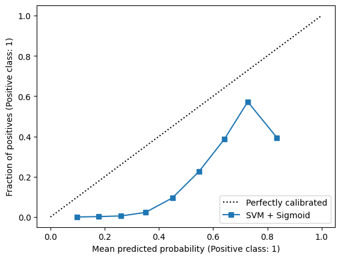
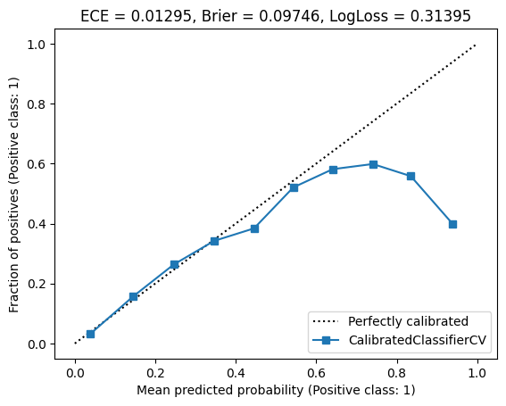
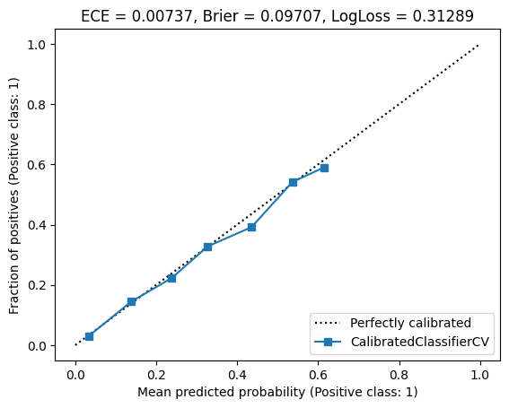
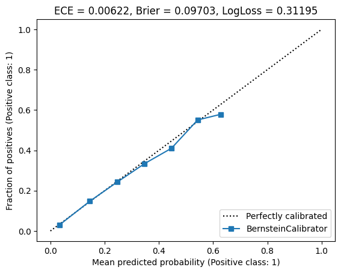
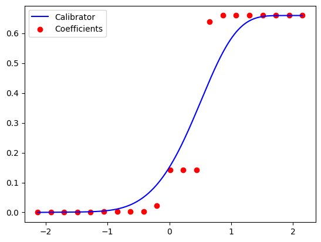
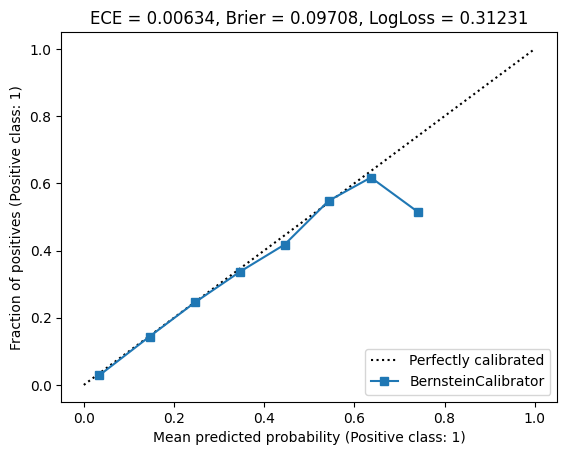
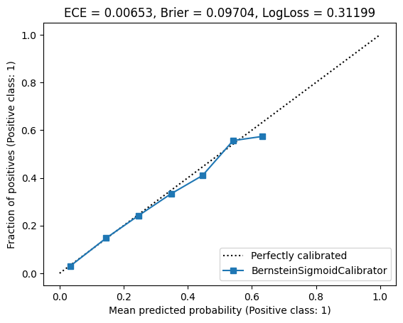

# Intro

We continue our journey in the land of polynomial regression and the Bernstein basis, that we began in [this post](), through another interesting landscape. There are many settings in which a model is trained to predict an abstract, meaningless score, which is later used for classification or ranking. For example, consider a linear support-vector machine (SVM) classifier. When classifying a sample, we only care about the sign of the score. If we take our SVM, and multiply its weights vector by a positive factor - we obtain the same classifier exactly. The scores are meaningless - only their sign is meaningful. Another example is the _learning to rank_ setting. Our model produces a score that is used to rank items, and select the top-$k$ items to the user. The scores themselves are not meaningful - only their relative order is. 

Statistically-inclined readers probably know that logistic regression tends to produce calibrated models out of the box. However, when the underlying logistic-regression model is a neural network, rather than a linear model, this is not the case. Indeed, there is a well-known paper by Guo et. al[^1] that shows otherwise. 

In many applications we want the score to represent some interpretable confidence in the prediction, and one way to achieve this is _calibration_.  A model is calibrated, if the scores it produces are probabilities that are consistent with the empirical frequency of observing a positive sample. One formal way to define calibration is as following:

>A supervised model $f$ trained on samples $$(x, y)\sim \mathcal{D}$$ with $$y \in \{0, 1\}$$  _calibrated_ if
>
>$$
>\mathbb{E}[y|f(x)] = f(x)
>$$
>

To make the discussion about calibration simpler, we avoid the discussion of models that produce multiple scores for a sample, such as multi-class and multi-label classifiers. 

Calibrated models are important, for example, in online advertising. We truly care that a model produces the probability of a click, or the probability of a purchase, since these probabilities are used to compute expectations. Another context is safety critical applications - there might be a difference betwen a $$0.00001\%$$ probability that our self-driving care observed a human, and $$0.1\%$$. 

One way to achieve calibration is to stack a _calibrator_ model $$\omega: \mathbb{R} \to [0, 1]$$ on top an already trained model $$f$$, so that the predictions become:

$$
\omega(f(x))
$$

If the calibrator $$\omega$$ is an increasing function, classification or ranking remain unaffected, since the relative order of scores is preserved. 

In this post we will use the power of the Bernstein basis in controlling the function we fit to devise _monotonic_ calibrators $$\omega$$ that fit the requirements.  Then, we compare the performance of our Bernstein calibrators to two built-in calibrators available in the Scikit-Learn package, that implements two well-known algorithms that are widely used to calibrate models throughout the industry. I recommend readers to take a look at the [model calibration tutorial](https://scikit-learn.org/stable/auto_examples/calibration/plot_calibration.html#sphx-glr-auto-examples-calibration-plot-calibration-py) of the Scikit-Learn package as well. As usual, the code is available in a [notebook](https://github.com/alexshtf/alexshtf.github.io/blob/master/assets/bernstein_calibration.ipynb) you can try in Google Colab.

# Working example - diabetes prediction
Throughout this post we will work with a support-vector machine classifier trained to predict diabetes on the CDC Diabetes Prediction Dataset. To easily access it, we can intall the ucimlrepo dataset that allow us to download it from the UCI machine-learning dataset repository:
```bash
pip install ucimlrepo
```
And now we can access it:
```python
from ucimlrepo import fetch_ucirepo

# fetch dataset
cdc_diabetes_health_indicators = fetch_ucirepo(id=891)

# data (as pandas dataframes)
X = cdc_diabetes_health_indicators.data.features
y = cdc_diabetes_health_indicators.data.targets
```
Let's print a summary of the data:
```python
print(X.describe().transpose()[['min', '25%', '50%', '75%', 'max']])
```
The following output is produced:
```
                       min   25%   50%   75%   max
HighBP                 0.0   0.0   0.0   1.0   1.0
HighChol               0.0   0.0   0.0   1.0   1.0
CholCheck              0.0   1.0   1.0   1.0   1.0
BMI                   12.0  24.0  27.0  31.0  98.0
Smoker                 0.0   0.0   0.0   1.0   1.0
Stroke                 0.0   0.0   0.0   0.0   1.0
HeartDiseaseorAttack   0.0   0.0   0.0   0.0   1.0
PhysActivity           0.0   1.0   1.0   1.0   1.0
Fruits                 0.0   0.0   1.0   1.0   1.0
Veggies                0.0   1.0   1.0   1.0   1.0
HvyAlcoholConsump      0.0   0.0   0.0   0.0   1.0
AnyHealthcare          0.0   1.0   1.0   1.0   1.0
NoDocbcCost            0.0   0.0   0.0   0.0   1.0
GenHlth                1.0   2.0   2.0   3.0   5.0
MentHlth               0.0   0.0   0.0   2.0  30.0
PhysHlth               0.0   0.0   0.0   3.0  30.0
DiffWalk               0.0   0.0   0.0   0.0   1.0
Sex                    0.0   0.0   0.0   1.0   1.0
Age                    1.0   6.0   8.0  10.0  13.0
Education              1.0   4.0   5.0   6.0   6.0
Income                 1.0   5.0   7.0   8.0   8.0
```
We see that most features are actually binary. Let's print the number of unique values of the non-binary columns:
```python
X[['BMI', 'GenHlth', 'MentHlth', 'PhysHlth', 'Age', 'Education', 'Income']].nunique()
```
We get the following output:
```
BMI          84
GenHlth       5
MentHlth     31
PhysHlth     31
Age          13
Education     6
Income        8
dtype: int64
```
Therefore, I decided to treat only a few of the non-binary features as numerical, and the rest as categorical:
```python
categorical_cols = ['HighBP', 'HighChol', 'CholCheck', 'Smoker', 'Stroke',
       'HeartDiseaseorAttack', 'PhysActivity', 'Fruits', 'Veggies',
       'HvyAlcoholConsump', 'AnyHealthcare', 'NoDocbcCost', 'GenHlth',
       'DiffWalk', 'Sex', 'Education',
       'Income']
numerical_cols = ['Age', 'BMI', 'MentHlth', 'PhysHlth']
```
Now let's do the usual magic, and split the data. However, in this post, in addition to train and test sets we will have a _calibration_ set whose purpose is training the calibrator model $$\omega$$. At this stage we will not use it, but let's be prepared. We will use 15% for the test set, another 15% for the calibration set, and 70% for the train set:
```python
from sklearn.model_selection import train_test_split

X_remain, X_test, y_remain, y_test = train_test_split(X, y, test_size=0.15, random_state=42)
X_train, X_calib, y_train, y_calib = train_test_split(X_remain, y_remain, test_size=0.15/0.85, random_state=43)
```
And now let's fit our linear support vector machine model. As usual, categorical features will be one-hot encoded, whereas numerical features will be min-max scaled. We use the `LinearSVC` lass for the classifier, with the `class_weight='balanced'` option to handle our imbalanced dataset, and the `dual=False` option to make it train faster in our case, when the samples greatly out-number the features:
```python
from sklearn.pipeline import Pipeline
from sklearn.preprocessing import OneHotEncoder, MinMaxScaler
from sklearn.compose import ColumnTransformer
from sklearn.svm import LinearSVC

pipeline = Pipeline([
    ('feature_transformer', ColumnTransformer(
        transformers=[
            ('categorical', OneHotEncoder(handle_unknown='infrequent_if_exist', min_frequency=10), categorical_cols),
            ('numerical', MinMaxScaler(), numerical_cols)
        ]
    )),
    ('classifier', LinearSVC())
])
```
Now let's fit our model to the training data, and reports its classification performance on the test set:

```python
from sklearn.metrics import classification_report

pipeline.fit(X_train, y_train)
print(classification_report(y_test, pipeline.predict(X_test)))
```
I got the following output:
```
              precision    recall  f1-score   support

           0       0.96      0.71      0.82     32840
           1       0.30      0.79      0.44      5212

    accuracy                           0.72     38052
   macro avg       0.63      0.75      0.63     38052
weighted avg       0.87      0.72      0.77     38052
```
Looking at the "macro avg" row, we see that it's not the best classifier in the world, but it has some discriminative power - the precision, recall, and F1 score are indeed reasonable. Enough to move on.

# Evaluating calibration

Before explaining _how_ calibration is evaluated, a short methodological note. Calibration should be evaluated on a held-out test set, not on the train set. If calibration is important for hyperparameter tuning, then we also need to evaluate it on the validation set. Now let's talk about _how_ we evaluate calibration.

One way to evaluate calbration is visually, using _calibration curves_ or _calibration reliability diagrams_[^2]. These curves attempt to directly visualize how far we are from our calibration criterion:

$$
\mathbb{E}[y|f(x)] = f(x)
$$

In theory, we would like to plot the points
$$
(\mathbb{E}[y|f(x)], f(x)) \qquad (x, y) \sim \mathcal{D},
$$
but we cannot, since we only have access to a finite data-set, not the distribution that generated it. Thus, in practice we resort to approximation by binning the outputs of $$f(x)$$ into sub-intervals of $$[0, 1]$$ and using averages instead of means. This is implemented by Scikit-Learn in the `CalibrationDisplay` class. 

Let's try it out with a very _naive_ calibrator - we will just take the output of our SVM, and pass it through the sigmoid function $$\sigma(z) = (1+\exp(-z))^{-1}$$. This will produce values in $$[0, 1]$$ that we can use:

```python
y_pred = pipeline.decision_function(X_test)
y_pred = 1 / (1 + np.exp(-y_pred))
CalibrationDisplay.from_predictions(y_test, y_pred, n_bins=10, name='SVM + Sigmoid')
plt.show()
```

I got the following plot:



In a perfectly calibrated classifier, the blue calibration curve should align with the dotted black line - the average prediction in each bin should align with the empirical positive sample frequency.

Beyond visuals means, we have metrics that can quantify the miscalibration error. The simplest of such metrics is the Empirical Calibration Error (ECE), whose computation is similar to how calibration curves are constructed. It is just the weighted average of calibration errors in each bin - the weights are the number of samples in each bin.  Since Scikit-Learn is an open-source project, I implemented the ECE metric based on its code for computing calibration curves:

```python
# implementation based on the code of calibration_curve in sklearn:
#   https://github.com/scikit-learn/scikit-learn/blob/872124551/sklearn/calibration.py#L927
def ece(y_true, y_prob, n_bins=10):
  bins = np.linspace(0.0, 1.0, n_bins + 1)
  binids = np.searchsorted(bins[1:-1], y_prob)

  bin_sums = np.bincount(binids, weights=y_prob, minlength=len(bins))
  bin_true = np.bincount(binids, weights=y_true, minlength=len(bins))
  bin_total = np.bincount(binids, minlength=len(bins))

  nonzero = bin_total != 0
  prob_true = bin_true[nonzero] / bin_total[nonzero]
  prob_pred = bin_sums[nonzero] / bin_total[nonzero]

  return np.sum(np.abs(prob_true - prob_pred) * bin_total[nonzero]) / np.sum(bin_total)
```

Now we can use this function to print the ECE of our naive sigmoid calibrator:

```python
print(f'ECE = {ece(y_test, y_pred)}')
```

The output is:

```python
ECE = 0.30732883382620496
```

At this stage it doesn't tell us much, until we begin improving it. 

In addition to the ECE, the standard cross-entropy loss and the mean-squared error loss can also help us quantify miscalibration.  In the context of probability calibration, the mean-squared error is known as the breier score. However, they have an inherent weakness - they quantify both miscalibration and discriminative power[^3]. For example, if our classifier is better at differentiating positive and negative samples than a competing classifier, these two losses show an improvement, even if its calibration error remains the same. Alternatively, improving only the calibration error without improving discriminative power also reduces these losses. However, since in this post the classifier remains identical due to the monotonic nature of calibrators, and only its calibration error changes, these two metrics are useful. Both are implemented in Scikit-Learn and we can use them:

```python
from sklearn.metrics import (
    brier_score_loss,
    log_loss
)

brier_score_loss(y_test, y_pred), log_loss(y_test, y_pred)
```

The output is

```python
(0.19391187428082382, 0.5748329800290517)
```

Now let's improve those numbers using calibrators designed for the task.

# Working with Scikit-Learn built-in calibrators

The simplest well-known calibrator is the Platt calibrator[^4], which essentially boils down to fitting a logistic regression model whose only feature is the original model prediction. Namely, the Platt classifier is a function of the form

$$
\omega(y) = \frac{1}{1 + \exp(a y + b)},
$$

where $$a$$ and $$b$$ are learned parameters. Where are these parameters learned from? That's what we have the above-mentioned _calibration set_. It is just the training set of the calibrator, and the training samples are $$\{ (f(x_i), y_i) \}_{i \in C}$$, where $$C$$ is the calibration set.

In Scikit-Learn, the Platt calibrator is implemented in the `CalibratedClassifierCV` class. This class is pretty versatile, and has various options for how a calibrator is trained, and what exactly is used as the calibration set. To make this post simple, we will use the `cv=prefit` option, which means that our model has been pre-fit, and we need to fit just the calibrator $$\omega$$ itself. The Platt calibrator can be chosen using the `method='sigmoid'` constructor option. So let's try it out!

```python
from sklearn.calibration import CalibratedClassifierCV

sigmoid_calib = CalibratedClassifierCV(pipeline, method='sigmoid', cv='prefit')
sigmoid_calib.fit(X_calib, y_calib)
```
To evaluate it, let's implement a short function that will show all the three metrics we care about:
```python
def estimator_errors(estimator, X_test, y_test):
  y_pred = estimator.predict_proba(X_test)[:, 1]
  return f'ECE = {ece(y_test, y_pred):.5f}, Brier = {brier_score_loss(y_test, y_pred):.5f}, LogLoss = {log_loss(y_test, y_pred):.5f}'
```
Now let's plot the calibration curve and the metrics!
```python
CalibrationDisplay.from_estimator(sigmoid_calib, X_test, y_test, n_bins=10)
plt.title(estimator_errors(sigmoid_calib, X_test, y_test))
plt.show()
```
Here is the output:



Looks a bit better. Some of the points lie on the diagonal line of perfect calibration, whereas others do not. However, looking at the metrics (in the title), we see that all of them were significantly improved, by orders of magnitude. This means that the points we see as mis-calibrated in the curve probably have little samples in the corresponding bins. Therefore, it is likely that their effect on the miscalibration error is quite small. It would be nice if Scikit-Learn could show the weight of each point using the point size, so we could see it visually - but unfortunately it does not.

The second well-known calibrators are piecewise-constant functions of the form

$$
\omega(y) = \begin{cases}
y_0 & y \leq x_1 \\
y_1 & x_1 < y \leq x_2 \\
\vdots &  \\
y_{n-1} & x_{n-1} < y \leq x_n \\
y_n & y > x_n
\end{cases},
$$

where $$y_0 < y_1 < \dots < y_n$$, and $$x_1, \dots, x_n$$ are learned from the calibration set. The mathematical procedure for fitting such a function to data is called _isotonic regression_[^5][^6], and using it for calibration is done by passing the `method='isotonic'` to the `CalibratedClassifierCV` class. So let's try it out as well!

```python
isotonic_calib = CalibratedClassifierCV(pipeline, method='isotonic', cv='prefit')
isotonic_calib.fit(X_calib, y_calib)

CalibrationDisplay.from_estimator(sigmoid_calib, X_test, y_test, n_bins=10)
plt.title(estimator_errors(sigmoid_calib, X_test, y_test))
plt.show()
```

I obtained the following plot:



Looks much better! And the three metrics were improved as well. We can also plot the piecewise-constant function:

```python
calibrator = isotonic_calib.calibrated_classifiers_[0].calibrators[0]
plt.plot(calibrator.f_.x, calibrator.f_.y)
plt.title(f'Caibrator with {len(calibrator.f_.x)} points')
plt.show()
```


We can see that our classifier produced scores approximately between -2 and 2 on the calibration set, and the best-fit piecewise constant function has 118 "jumps". 

There are two interesting observations we can make. First, a piecewise-constant function can harm ranking and classification, since it's not strictly increasing by definition. Two samples having different, but nearby scores might be mapped to the same score. Second, the number of jumps may become large as the size of the calibration data-set increases. This means that inference may also become expensive, since computing $$\omega(y)$$ requires performing a lookup for the interval $$y$$ belongs to. So can we do better?

# Calibration with Bernstein polynomials

In a [previous post]() in our adventures with polynomial regression we saw an interesting theorem. Suppose our calibrator is:

$$
\omega(y) = \sum_{i=0}^n u_i b_{i,n}(y),
$$

where   $$\{ b_{i,n} \}_{i=0}^n$$ is the $$n$$-degree Bernstein basis. Then having $$u_{i+1} \geq u_i$$ implies that $$\omega$$ is increasing. Therefore, we can fit our calibrator to the calibration set $$(\hat{y}_1, y_1), \dots, (\hat{y}_m, y_m)$$ by solving a constrained polynomial regression problem using the Bernstein basis. Denoting $$\mathbf{b}(y) = (b_{0,n}(y), \dots, b_{n,n}(y))^T$$, we need to solve:

$$
\begin{aligned}
\min_{\mathbb{u}} &\quad \sum_{j=1}^m \left( \mathbf{b}(\hat{y}_j)^T \mathbf{u} - y_j \right)^2 \\
\text{s.t.} 
  &\quad 0 \leq u_i \leq 1, & i = 0, \dots, n \\
  &\quad u_{i} \geq u_{i-1}, & i = 1, \dots, n
\end{aligned}
$$

Letting $$\hat{\mathbf{V}}$$ be the Vandermonde matrix whose rows are $$\mathbf{b}(y_j)$$, we can write the above problem as:

$$
\begin{aligned}
\min_{\mathbf{u}} &\quad \sum_{j=1}^m \left( \hat{\mathbf{V}} \mathbf{u} - y_j \right)^2 \\
\text{s.t.} 
  &\quad 0 \leq u_i \leq 1, & i = 0, \dots, n \\
  &\quad u_{i} \geq u_{i-1}, & i = 1, \dots, n
\end{aligned}
$$

Having found the optimal solution $$\mathbf{u}^*$$ our calibrator's prediction becomes: 

$$
\omega(y) = \mathbf{b}(y)^T \mathbf{u}^*.
$$

The only issue stems from the fact that the underlying model's predictions $$y_j$$ are not necessarily in $$[0, 1]$$. As we already saw, the remedy comes from a simple min-max scaling.  So let's code our Bernstein calibrator!

As you probably guessed, the Calibrator is just another Scikit-Learn classifier that wraps its underlying classifier, and applies the calibration procedure on top of its predictions.  The convex optimization problem will be solved by [CVXPY](https://www.cvxpy.org/), which we encountered before in this series. For the code in this post to work correctly, please make sure you have version 1.5 or above.  So here it is:
```python
from sklearn.base import ClassifierMixin, MetaEstimatorMixin, BaseEstimator
import cvxpy as cp
from scipy.stats import binom

class BernsteinCalibrator(BaseEstimator, ClassifierMixin, MetaEstimatorMixin):
  def __init__(self, estimator=None, *, degree=20):
    self.estimator = estimator
    self.degree = degree

  def fit(self, X, y):
    pred = self._get_predictions(X)
    self.classes_ = self.estimator.classes_

    # compute min / max for scaling
    self.min_ = np.min(pred)
    self.max_ = np.max(pred)

    # compute Vandermonde matrix
    vander = self._bernvander(pred)

    # find Bernstein polynomial coefficients
    self.coef_ = self._fit_coef(vander, y)
    return self

  def _fit_coef(self, vander, y):
    coef = cp.Variable(self.degree + 1, bounds=[0, 1])
    objective = cp.norm(vander @ coef - y)
    constraints = [cp.diff(coef) >= 0]
    prob = cp.Problem(cp.Minimize(objective), constraints)
    prob.solve()

    return coef.value

  def predict_proba(self, X):
    pred = self._get_predictions(X)
    calibrated = self._calibrate_scores(pred).reshape(-1, 1)
    return np.concatenate([1 - calibrated, calibrated], axis=1)

  def _calibrate_scores(self, pred):
    vander = self._bernvander(pred)
    return np.clip(vander @ self.coef_, 0, 1)

  def _bernvander(self, pred):
    scaled = (pred - self.min_) / (self.max_ - self.min_)
    scaled = np.clip(scaled, 0, 1)

    basis_idx = np.arange(1 + self.degree)
    return binom.pmf(basis_idx, self.degree, scaled[:, None])

  def _get_predictions(self, X):
    estimator = self.estimator
    if estimator is None:
      estimator = LinearSVC(random_state=0, dual="auto")
    if hasattr(estimator, 'predict_proba'):
      pred = estimator.predict_proba(X)
      return pred[:, 1]
    elif hasattr(estimator, 'decision_function'):
      return estimator.decision_function(X)
    else:
      raise RuntimeError('Estimator must have either predict_proba or decison_function method')
```
The `fit` method computes the minimum and maximum observed values for the min-max scaling mechanism. Then it fits the coefficients using CVXPY by calling the `_fit_coef` method.  The `predict_proba` method just evaluates the fitted Bernstein polynomial after computing the predictions of the underlying estimator. The `_bernvander` method computes the Vandermonde matrix for a vector of predictions after applying the min-max scaling. The rest of the code is straightforward boilerplate.

Now let's try it out, and fit a polynomial calibrator of degree 20:
```python
bernstein_calib = BernsteinCalibrator(pipeline, degree=20)
bernstein_calib.fit(X_calib, y_calib)

CalibrationDisplay.from_estimator(bernstein_calib, X_test, y_test, n_bins=10)
plt.title(estimator_errors(bernstein_calib, X_test, y_test))
plt.show()
```
I got the following result:



Nice! All error metrics became smaller. The claibration curve looks good. And our model has a much smaller number of parameters than the isotonic one - only 21 coefficients, instead of 118. We can also plot the calibration function $$\omega(y)$$, with the Bernstein coefficients as control points:

```python
xs = np.linspace(bernstein_calib.min_, bernstein_calib.max_, 1000)
ys = bernstein_calib._calibrate_scores(xs)
plt.plot(xs, ys, label='Calibrator', color='blue')

ctrl_xs = np.linspace(bernstein_calib.min_, bernstein_calib.max_, bernstein_calib.degree + 1)
ctrl_ys = bernstein_calib.coef_
plt.scatter(ctrl_xs, ctrl_ys, label='Coefficients', color='red')

plt.legend()
plt.show()
```

I got the following plot:



So maybe we can work with an even lower degree? Let's try fitting a polynomial calibrator of degree 10:

```python
bernstein_calib_lowdeg = BernsteinCalibrator(pipeline, degree=10)
bernstein_calib_lowdeg.fit(X_calib, y_calib)

CalibrationDisplay.from_estimator(bernstein_calib_lowdeg, X_test, y_test, n_bins=10)
plt.title(estimator_errors(bernstein_calib_lowdeg, X_test, y_test))
plt.show()
```

The result is below:



The curve looks a bit worse, but the metrics still outperform isotonic regression.

But wait! A calibrator is essetially a probability prediction model, and we know just the right tool for the task - logistic regression. In fact, we already saw the Platt calibrator that was in fact a simple logistic regression model, whose only feature is the underlying prediction. So maybe, using logistic, rather than least-squares regression we can work with an even lower degree polynomial and achieve good calibration. 

For logistic regression, our loss function, or the minimization objective, need to be modified. Moreover, logistic regression coefficients may, in theory, go to infinity (or minus infinity) if the optimal prediction for some feature combinations is close to zero or one. This may cause the minimization procedure to declare that the problam is not solvable. Thus, we cap the Bernstein ceofficients to be in the range $$[-15, 15]$$, in addition to the monotonicity constraint. This ensures that our model's predictions are also in that range, and the sigmoid function evaluated at the endpoints are 0 and 1 for all practical purposes. So, our modified convex optimization problem becomes:

$$
\begin{aligned}
\min_{\mathbb{u}} &\quad \sum_{j=1}^m \left( \ln(1+\exp(\mathbf{b}(\hat{y}_j)^T \mathbf{u})  - y_j\mathbf{b}(\hat{y}_j)^T \mathbf{u} \right) \\
\text{s.t.} 
  &\quad -15 \leq u_i \leq 15, & i = 0, \dots, n \\
  &\quad u_{i} \geq u_{i-1}, & i = 1, \dots, n
\end{aligned}
$$

Carefully inspecting the objective - it's just the regular loss of the logistic regression problem. To implement it, we just override the `_fit_coef` method to implement the above minimization problem as the fitting procedure, and the `_calibrate_scores` method to apply the sigmoid function after computing the Bernstein polynomial. So here it is:
```python
class BernsteinSigmoidCalibrator(BernsteinCalibrator):
  def _compute_coef(self, vander, y):
    coef = cp.Variable(self.degree + 1, bounds=[-15, 15])
    scores = vander @ coef
    objective = cp.sum(cp.logistic(scores) - cp.multiply(y, scores))
    constraints = [cp.diff(coef) >= 0]
    prob = cp.Problem(cp.Minimize(objective), constraints)
    prob.solve()

    return coef.value

  def _calibrate_scores(self, pred):
    vander = self._bernvander(pred)
    return self._sigmoid(vander @ self.coef_)

  @staticmethod
  def _sigmoid(scores):
    return np.piecewise(
        scores,
        [scores > 0],
        [lambda z: 1 / (1 + np.exp(-z)), lambda z: np.exp(z) / (1 + np.exp(z))]
    )
```
Note, that to avoid overflows and other numerical issues, we carefully implemented the sigmoid function to handle positive and negative values differently. Now let's try it out with a degree of 10.
```python
bernstein_sigmoid_calib = BernsteinSigmoidCalibrator(pipeline, degree=10)
bernstein_sigmoid_calib.fit(X_calib, y_calib)

CalibrationDisplay.from_estimator(bernstein_sigmoid_calib, X_test, y_test, n_bins=10)
plt.title(estimator_errors(bernstein_sigmoid_calib, X_test, y_test))
plt.show()
```
The result is:



Nice! With a degree of 10, we achieved a similar result than least-squares fitting with a degree of 20. To summarize, here are the metrics. The best metric is highlighted.

| Calibrator                               | ECE         | Breier      | LogLoss     |
| ---------------------------------------- | ----------- | ----------- | ----------- |
| Platt                                    | 0.01295     | 0.09746     | 0.31395     |
| Isotonic                                 | 0.00737     | 0.09707     | 0.31289     |
| Bernstein (deg = 20)                     | **0.00622** | **0.09703** | **0.31195** |
| Bernstein (deg = 10)                     | 0.00634     | 0.09708     | 0.31231     |
| Bernstein logistic regression (deg = 10) | 0.00653     | 0.09704     | 0.31199     |

# Conclusion

We saw an interesting application of the ability to control the derivative of polynomials represented in the Bernstein basis for model calibration. I welcome you to try it our for your own work, where controlling derivatives in the context of your machine-learned models is important.

As a side note, there are other bases that allow controling derivatives in a similar manner. For example, the well-known B-Spline basis for polynomial splines. But that's out of scope for our series - my objective was showing that polynomial regression is not that "scary overfitting monster", but rather a useful tool in machine learning. 

My next, and final post in the series will be of a more exploratory nature - of trying to understand why the Bernstein basis is useful for fitting polynomial models from a different, statistical perspective. Stay tuned!

------

[^1]: Chuan Guo, Geoff Pleiss, Yu Sun, Kilian Q. Weinberger. _On Calibration of Modern Neural Networks_. Proceedings of the 34th International Conference on Machine Learning (2017)
[^2]: Morris H. Degroot, Stephen E. Fienberg. _The Comparison and Evaluation of Forecasters._ Journal of the Royal Statistical Society: Series D (The Statistician) (1983)
[^3]: Allan H. Murphy. _A New Vector Partition of the Probability Score._ Journal of Applied Meteorology and Climatology (1973).
[^4]: Platt, John. _Probabilistic outputs for support vector machines and comparisons to regularized likelihood methods."_ Advances in large margin classifiers 10.3 (1999)
[^5]:R.E. Miles. _The Complete Amalgamation into Blocks, by Weighted Means, of a Finite Set of Real Numbers._ Biometrika 46.3 (1959)
[^6]: D. J. Bartholomew. _A Test of Homogeneity for Ordered Alternatives. II_ Biometrika 46.3 (1959)
