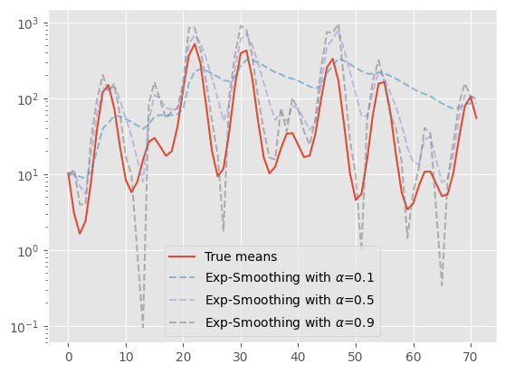
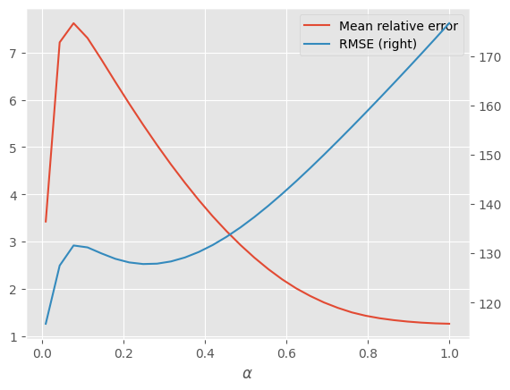

# Intro

Simplicity. Don't we all love simplicity? The so-called "applied science" groups in the industry love it as well. When working on advertising at Yahoo we had plenty of those 'simple and practical' solutions for various prediction and control tasks. Consider, for example, an ad campaign that produces hourly revenue . We would like to predict how much revenue would it produce in the next hour given its history. A well-known idea is the [exponential smoothing](https://en.wikipedia.org/wiki/Exponential_smoothing): given a factor $$\alpha \in [0, 1]$$, we compute the sequence 
$$
\begin{align*}
y_1 &= x_0\\
y_{i+1} &= (1 - \alpha) y_i + \alpha x_i 
\end{align*}
$$

Each $$y_i$$ is a weighted average of the history $$x_0, \dots, x_{i-1}$$, where most recent historical values have higher weights, and it may serve as some form of reasonable prediction for $$x_i$$. We will use the hourly ad campaign revenue as or running exammple, but the ideas, of course, apply to many other domains.

It is one of those 'simple and practical' things applied science groups do, before trying something more advanced. It's extremely easy to deploy in production: the "model" is just a number per ad campaign, which we can put in a simple file that is updated hourly. It also intuitively appears to do what we want - track the changing trends of how the campaign produces revenue, since this kind of weighted average gives more weight to more recent observations. It also appears as something we can reason about - we can compute the 'half-life' of the observations we track: observations of $$k \approx \ln(0.5) / \ln(1 - \alpha)$$ days ago have a weight less than a half.

Nice and easy! Right? Right? There are many cases when this apparently simple idea may not be that simple, and may not even be that practical. Why? Well, one of the reasons is because it is just _gradient descent_ in disguise! 

# Exponential smoothing as gradient descent

Consider the sequence of loss functions $$\ell_i(y) = \frac{1}{2}(y - x_i)^2$$. The derivative is:
$$
\ell'_i(y) = (y - x_i).
$$
Now, we can see that our exponential smoothing algorithm is nothing more than an online gradient descent method applied to the sequence of losses $$\ell_1, \ell_2, \dots$$, with a _constant_ step-size $$\alpha$$:
$$
\begin{aligned}
y_{i+1} 
  &= y_i - \alpha \ell_i'(y_i) \\
  & = y_i - \alpha (y_i - x_i) \\
  &= (1 - \alpha) y_i + \alpha x_i
\end{aligned}
$$
Whoa! Now we have several questions to ask here:

1. Is a constant step-size for our gradient descent the best strategy in this setting?
2. The loss functions aim to minimize the mean-squared error. Is this the right thing to do for money? Do we care about absolute errors, or relative (percentage) errors?
3. Don't we have other simple alternatives to gradient descent that perform better in this setting?

# Simulating ad campaigns

So before we study exponential smoothing in a bit more detail, let's first write some utility functions to simulate the revenue of ad campaigns. This is, of course, just a simulation, and we are going to make some assumptions.

Our ad campaign hourly revenue is going to be composed of two components - a periodic component, repeating every day, and a global trend. This will model the logarithm of the _mean_ revenue in each hour. So let's start from the periodic part:

```python
import numpy as np

def periodic_trend(hours):
    angles = 2 * np.pi * hours / 24 # arg for periodic trends: day = 2pi
    angles = angles.reshape(1, -1)

    # Fourier sequence of 3 frequencies - periodic trend
    coefficients = np.random.standard_t(df=4, size=(3, 1))
    phases = np.random.uniform(low=0, high=2*np.pi, size=(3, 1))
    frequencies = np.arange(1, 4).reshape(3, 1)
    return np.sum(
        coefficients * np.cos(frequencies * angles + phases), 
        axis=0
    )
```

We use the Student-T distribution for the coefficients mainly due to its heavier tails. It allows the curves to be more diverse. This is what some randomly generated periodic trends look like:

```python
import matplotlib.pyplot as plt

hours = np.arange(72)
np.random.seed(42)
plt.plot(periodic_trend(hours), label='one')
plt.plot(periodic_trend(hours), label='two')
plt.plot(periodic_trend(hours), label='three')
plt.xlabel('Hour')
plt.ylabel('Log-revenue')
plt.legend()
plt.show()
```


Seems indeed like a bunch of random waveforms that repeat every 24 hours. Now let's generate some 'global' trends that are not trivial. For that, I found it easy to use the well-known [Bezier curves](https://en.wikipedia.org/wiki/B%C3%A9zier_curve):

```python
def global_trend(hours, total_hours=72):
    normalized_hours = hours / total_hours

    # Bezier curve with 3 coefficients - global trend
    #    see: https://en.wikipedia.org/wiki/B%C3%A9zier_curve
    global_trend_coef = np.random.standard_t(df=3, size=4)
    global_trend_basis = scipy.stats.binom.pmf(
        np.arange(4), 3, normalized_hours.reshape(-1, 1))
    return 3 * global_trend_basis @ global_trend_coef
```

Again, the coefficients come from the Student-T distribution to create interesting and diverse curves. Here are three such curves:

```python
plt.plot(global_trend(hours), label='one')
plt.plot(global_trend(hours), label='two')
plt.plot(global_trend(hours), label='three')
plt.xlabel('Hour')
plt.ylabel('Log-revenue')
plt.legend()
plt.show()
```


So now we can product interesting trends by summing up the two randomly generated trends. Here is an example of three log-mean-revenue trends for three ad campaigns running for 72 hours:

```python
plt.plot(periodic_trend(hours) + global_trend(hours), label='one')
plt.plot(periodic_trend(hours) + global_trend(hours), label='two')
plt.plot(periodic_trend(hours) + global_trend(hours), label='three')
plt.xlabel('Hour')
plt.ylabel('Log-revenue')
plt.legend()
plt.show()
```


Nice! Indeed, we got diverse log-revenue curves.

The last part is actually generating hourly revenue samples, rather than means. To make things a bit more challenging and more realistic, we note that occasionally ad campaigns produce _no_ revenue ad all for an entire hour, for various reasons. So we shall use [zero-inflated](https://en.wikipedia.org/wiki/Zero-inflated_model) [log-normal](https://en.wikipedia.org/wiki/Log-normal_distribution) distributions to generate samples.  Zero-inflated, because there is some unusually large probability to get a zero. In our case, the probability of getting  zero revenue increases as the mean gets closer to zero. We use log-normal, because typically revenue samples tend to go a bit far from the mean, and the log-normal distribution model them well enough[^1].

```python
def zero_inflated_lognormal(log_means, lognormal_sigma=0.3):
    # p_zero is higher when mean-revenue is smaller, with this 'hairy' formula
    means = np.exp(log_means)
    p_zero = 1 - np.sqrt(np.arcsinh(means) / np.arcsinh(1 + np.max(means)))

    lognormal_mu = log_means - np.log1p(-p_zero) - (lognormal_sigma ** 2) / 2
    lognormals = np.random.lognormal(lognormal_mu, lognormal_sigma)
    nonzero_indicators = np.random.binomial(2, 1 - p_zero)
    return lognormals * nonzero_indicators


def simulate_campaign(seed=42):
    np.random.seed(seed)

    num_hours = 72
    ts = np.arange(0, num_hours)
    log_means = periodic_trend(ts) + global_trend(ts, num_hours)
    samples = zero_inflated_lognormal(log_means)

    return ts, np.exp(log_means), samples
```

I don't want to go into the hairy formulas there, but instead I will just plot four ad campaigns (one for each random seed) to show you how the revenue samples look like:

```python
figure, axs = plt.subplots(2, 2, figsize=(12, 8))
axs = axs.ravel()
for i, seed in enumerate([42, 43, 44, 45]):
    hours, means, samples = simulate_campaign(seed)

    # plot revenue means
    axs[i].plot(hours, means, label='mean')
    
    # plot revenue samples
    s = axs[i].scatter(hours, samples, alpha=0.5, label='samples')

    # plot bars connecting means to samples
    bars_style=dict(color=s.get_facecolor(), ls='--')
    for t, m, y in zip(hours, means, samples):
        axs[i].plot([t, t], [m, y], **bars_style)

    axs[i].set_yscale('asinh') # like log-scale, but supports zero and near-zero values
    axs[i].set_xlabel('Hour')
    axs[i].set_ylabel('Revenue')
```


Alright! They indeed seem diverse, and occasionally have a zero revenue here and there. Now we are ready to play.

# Playing with exponential smoothing

Implementing exponential smoothing is quite easy:

```python
def exp_smooth(samples, alpha):
    r = np.zeros_like(samples)
    r[0] = samples[0]
    for t in range(1, len(samples)):
        r[t] = alpha * samples[t] + (1 - alpha) * r[t - 1]
    return r
```

The vector `r` is filled with exponentially-smoothed samples by directly applying the formula. No magic.  Let's visually appreciate the predictions this method produces by generating a campaign, running the method, and plotting the predictions vs means for various parameters $$\alpha$$:

```python
import matplotlib.pyplot as plt

# a generic prediction plotting function that we will use for other methods too, not only
# for exponential smoothing
def plot_predictions(predictor, predictor_name, params, param_name, seed=42):
    ts, means, samples = simulate_campaign(seed=seed)

    plt.plot(ts, means, label='True means')
    for p in params:
        preds = predictor(samples, p)
        plt.plot(ts, preds, '--', alpha=0.5, label=f'{predictor_name} with {param_name}={p}')
    plt.legend()
    plt.yscale('log')
    plt.show()


# running our prediction plotting function for exponential smoothing
plot_predictions(exp_smooth, 'Exp-Smoothing', [0.1, 0.5, 0.9], '$\\alpha$')
```



Well, we can see that a small $$\alpha$$ smoothed out the revenue trend a lot, as expected. We give a higher weight to historical samples, and lower weight to recent samples. This is reversed for higher values of $$\alpha$$, where the smoothed-out curve tends to give a higher weight to recent samples and discard history faster. So how well does it perform? Well, let's measure _two_ prediction errors:

1.   Root Mean-Squared Error: $$\mathrm{RMSE} =\sqrt{ \frac{1}{n} \sum_{i=1}^n (y_i - y_i^{\mathrm{true}} )^2 }$$
2.   Mean relative error: $$\mathrm{MRE} = \frac{1}{n} \sum_{i=1}^n \frac{|y_i - y_i^{\mathrm{true}}|}{\max(\varepsilon,y_i^{\mathrm{true}})}$$

The root mean-squared error is what actually the squared loss aims to optimize for. The square-root is typically added to restore the units to the original units of the predicted variable. 

The relative error here measures the error in fractions of the true value, with $$\varepsilon>0$$ is a small parameter that avoids division by zero. This is what typically the right error to use for sums of money - how many percents are we away from the true prediction? This kind of relative error is an extremely common one, and is meaningful to business people. Let's implement the two metrics:

```python
def mean_relative_error(y, yref, epsilon=0.01):
    return np.mean(np.abs(y - yref) / np.maximum(epsilon, yref))

def rmse(y, y_ref):
    return np.sqrt(np.mean(np.square(y - y_ref)))
```

Now we can compute them for various choices of the hyper-parameter $$\alpha$$, and plot them:

```python
import pandas as pd

# a generic function for computing relative errors of a predictor
# for various hyper-parameter values. It runs the predictor with 
# each hyper-parameter and computes the errors.
def compute_errors(samples, means, predictor, params, param_name):
    relative_errors = np.zeros_like(params)
    rmses = np.zeros_like(params)
    for i, p in enumerate(params):
        preds = predictor(samples, p)
        relative_errors[i] = mean_relative_error(preds, means)
        rmses[i] = rmse(preds, means)

    return pd.DataFrame({
            param_name: params,
            'Mean relative error': relative_errors,
            'RMSE': rmses
        })

# simulates an ad campaign and plots its prediction errros
def plot_errors(predictor, params, param_name, seed=42):
    ts, means, samples = simulate_campaign(seed=seed)
    error_df = compute_errors(samples, means, predictor, params, param_name)
    error_df.plot(x=param_name, 
                  y=['Mean relative error', 'RMSE'], 
                  secondary_y=['RMSE'],
                  legend=True, 
                  logx=True)
 
# use our generic prediction error plotting to visualize
# exponential-smoothing prediction errors
plot_errors(exp_smooth, np.linspace(0.01, 1, 30), '$\\alpha$')
```



The relative error is plotted on the left y-axis, whereas the RMSE is on the right y-axis. The plotted relative error is in fractions, rather than percents. So a relative error of 3 means we're 300% off. 

We can see two interesting phenomena:

*   The prediction error heavily depends on the step-size. And the differences between step-sizes are _enormous_: ~100% relative error vs. ~700%.
*   The relative error, which is what we truly care about, does not necessarily correlate with the RMSE. Indeed, a larger $$\alpha$$ degrades the RMSE, but actually improves the relative error.

How much does it depend on the step-size? Well let's try visualizing the mean relative error for four different ad campaigns as a function of the step-size. The four ad campaigns are generated with four different random seeds.

```python
def plot_multiple_errors(predictor, params, param_name, seeds=[1, 100, 500, 1000]):
    for seed in seeds:
        ts, means, samples = simulate_campaign(seed=seed)
        error_df = compute_errors(samples, means, predictor, params, param_name)
        plt.plot(error_df[param_name], 
                 error_df['Mean relative error'], 
                 label=f'Seed = {seed}')
    plt.legend()
    plt.show()

plot_multiple_errors(exp_smooth, np.linspace(0.1, 1, 20), '$\\alpha$')
```


We can see that for the campaign generated by $$\mathrm{seed}=1$$ the best prediction error is obtained around $$\alpha\approx0.4$$, and significantly increases away from this value. In contrast, the campaign generated by $$\mathrm{seed}=500$$ achieves its best error around $$\alpha \approx 0.9$$. This actually means that it is extremely hard to tune a smoothing parameter $$\alpha$$ that works well accross ad campaigns. This leads us to a conclusion that

>   upon close inspection, the "simple and practical" exponential smoothing method is may be neither **simple** nor **practical**.

It's not simple to tune a parameter for every campaign, and it's not practical to do so. It's actually an extremely hard problem. Some readers may claim that choosing a step-size that doesn't work so well is a good initial baseline to start with. But I hope thay reading the remainder of this post will convince you that extremely easy to implement methods that essentially do the same, update  one number per campaign with a few lines of Python code, are significantly better initial baselines.

For me, a simple algorithm is not only one which is easy to implement and deploy, but also one that requires little 'babysitting'. In our case, it's tuning step-sizes, and monitoring it in production to see that it doesn't produce unreasonable predictions for various campaigns.  

In the remainder of this post we will see that the optimization perspective, viewing exponential smoothing as gradient descent, lets us address the two desiderata: customizing for what the business needs (relative error), and reduction of babysitting.

# Relative error


---

**References**

[^1]: Stram, R., Abboud, R., Shtoff, A., Somekh, O., Raviv, A., & Koren, Y. (2024, May). Mystique: A Budget Pacing System for Performance Optimization in Online Advertising. In *Companion Proceedings of the ACM on Web Conference 2024* (pp. 433-442).

