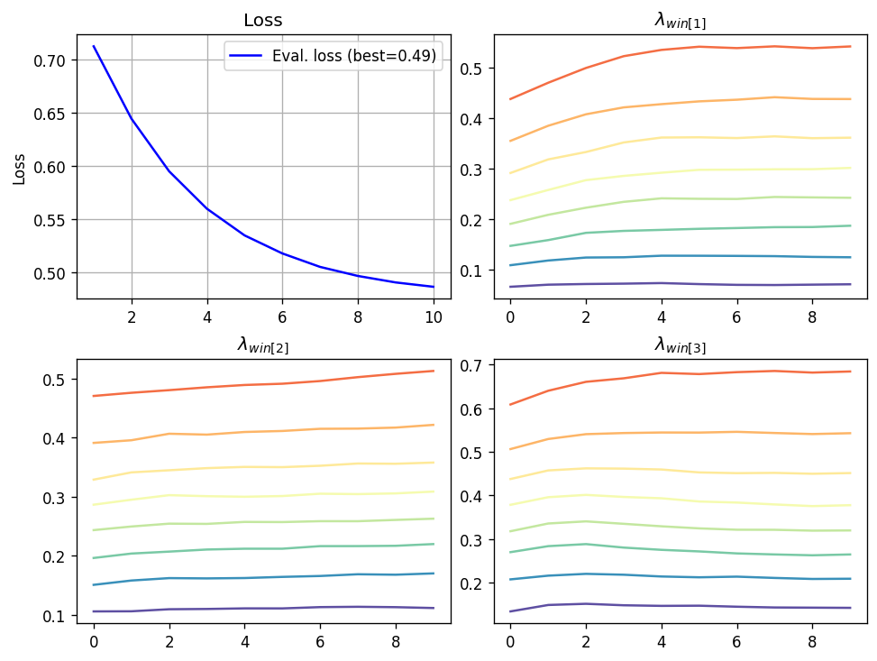
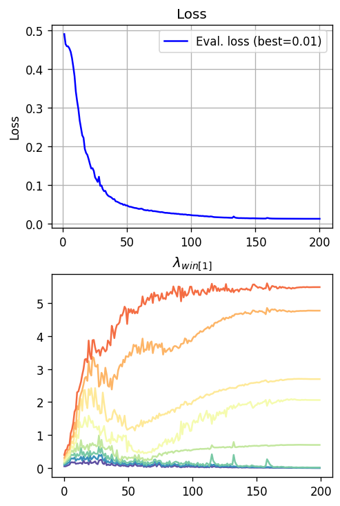
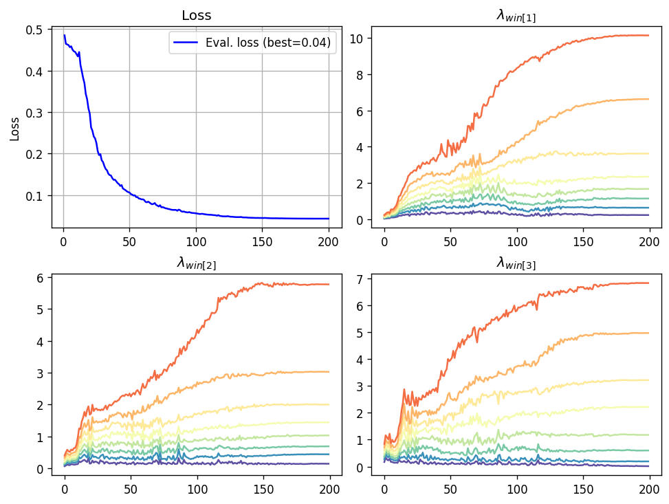
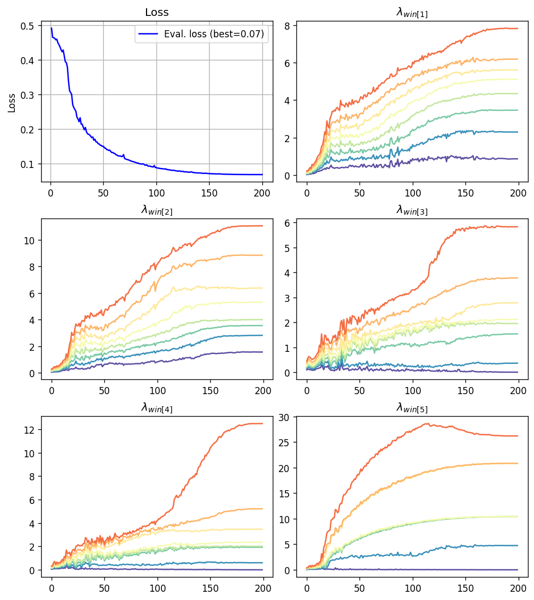
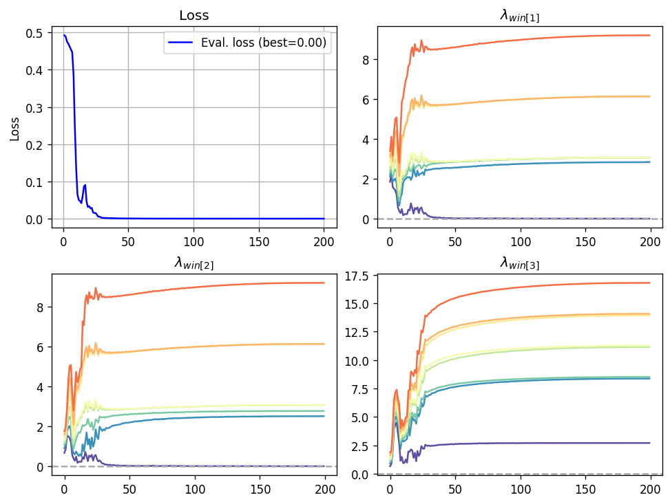
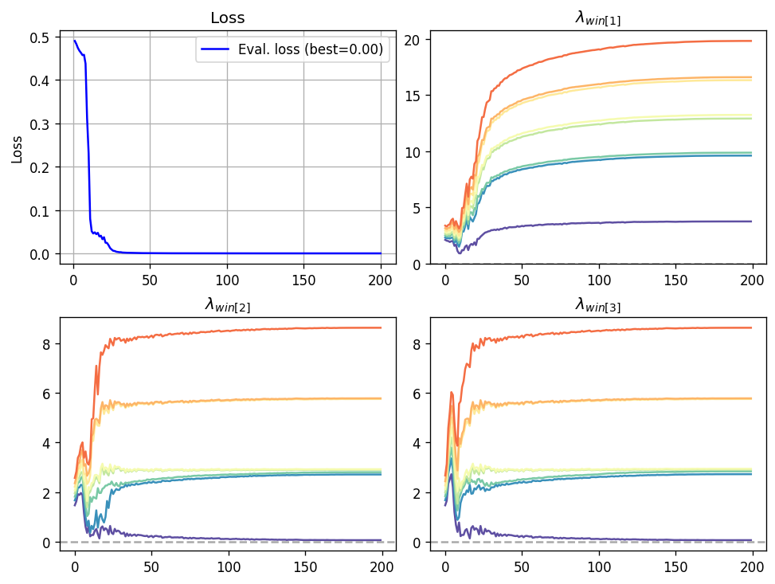
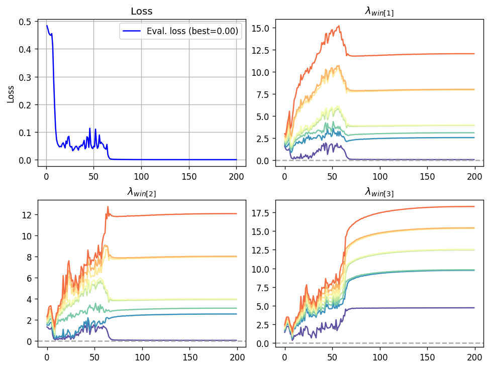
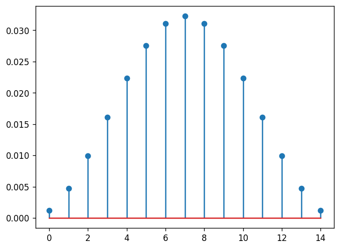
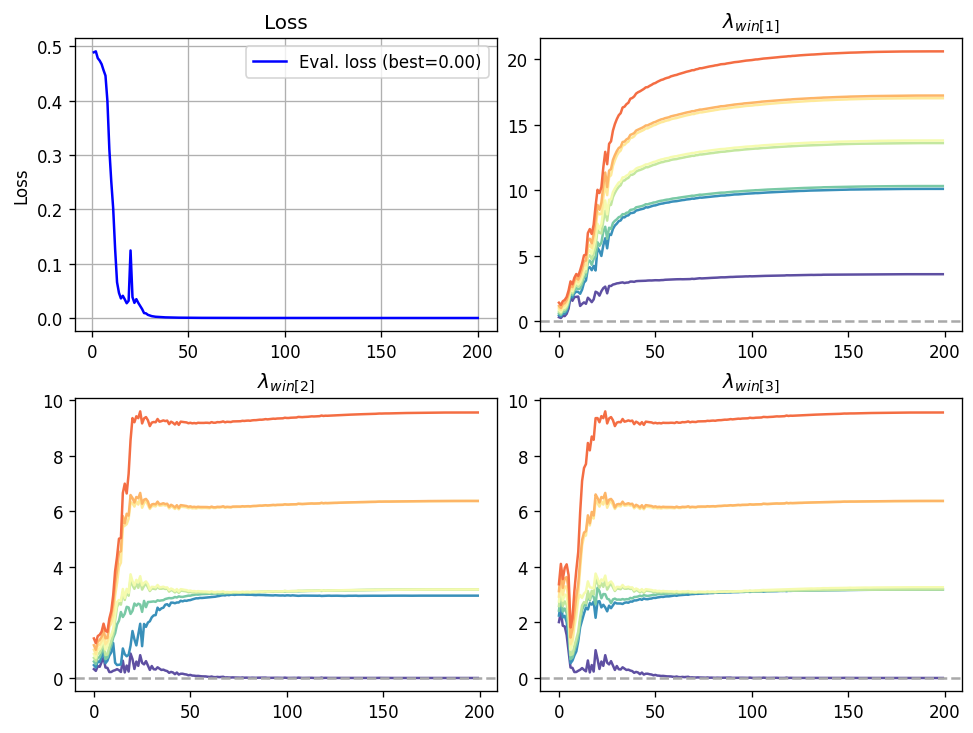

# Intro

Our last post focused on showing that our family of eigenvalue neurons,
$$
f({\boldsymbol x};{\boldsymbol A}_{0..n}) = \lambda_k \Bigl({\boldsymbol A}_0 + \sum_{i=1}^n x_i {\boldsymbol A}_i\Bigr),
$$
where each $$\boldsymbol A_i \in \mathbb{R}^{d \times d}$$ is a symmetric matrix, can be greatly accelerated by considering the matrices to be _tri-diagonal_. We may lose a bit of expressive power, depending on the data-set, but we gain substantial speed and cost. However, we observed that the rate of convergence is quite slow. I was not able to achieve the results I have with less than ~300 epochs for the smaller models and ~500 epochs for the larger models, which is quite a lot. With tri-diagonal matrices each epoch is faster and cheaper, but why would we need so many epochs?

If we take any analysis of first-order optimization methods, like SGD or Adam, a central quantity that affects the speed of convergence is the variability of the gradient. It is manifested in two ways - statistical, and geometric.  In the statistical sense, it means that the variance of the gradients over the training set, or perhaps some other measure of statistical variability, should be small. Smaller deviation yields faster convergence. In the geometric sense, the gradient of our function changes slowly - meaning nearby inputs should have similar gradients. A formal treatment can be found in the excellent tutorial by Bottou et. al.[^1], but this is not the main point here.  The main point here is the the two are tightly related, since both deviation w.r.t the training data $$\boldsymbol x$$ or w.r.t the model's parameters $$\boldsymbol A_{0..n}$$, which are at the heart of the statistical and geometric views,  lead to the same concept - how fast do the the derivatives of $$\lambda_k(\boldsymbol W)$$ vary as we vary the matrix $$\boldsymbol W$$.  

So in this post we will understand the behavior of $$\lambda_k(\cdot)$$ from this perspective, and try to gradually come up with an alternative that is better behaved in this sense, in order to "tame the monster" and improve the speed of convergence. This incurs some computational cost, but the improvement in the rate of convergence is worth it in our experiments here, and may be worth it on your datasets as well. 

To make things more efficient, in this post we shall also continue with the trend of using symmetric tri-diagonal matrices, since I don't think we should be using expensive computing when we can avoid it while still being computationally efficient.

# Eigenvector perturbations

The $$k$$-th eigenvalue $$\lambda_k(\boldsymbol W)$$ has a corresponding normalized eigenvector $$\boldsymbol{v}_k(\boldsymbol W)$$. As we pointed out in a [previous post]({{"2026-01-20-Spectrum-Speed" | post_url}}), we have:
$$
\nabla \lambda_k(\boldsymbol W) = \boldsymbol{v}_k(\boldsymbol W) \boldsymbol{v}_k(\boldsymbol W)^T.
$$
We know that the eigenvector is not unique. For example, if $$\boldsymbol v$$ is an eigenvector, so is $$- \boldsymbol v$$. Sign, of course, is not a problem - it cancels out in the above product, and the gradient is well defined. But it may also be an entire subspace of eigenvectors due to multiplicities, so obviously it cannot be _the_ gradient. As we already discussed it in the above-mentioned post - it's a Clarke sub-gradient, which is a set of vectors that generalize the gradient. The formula above is true for _any_ normalized eigenvector - we always get a Clarke sub-gradient. 

So the question we are dealing here is - what can we say about $$\| \nabla \lambda_k(\boldsymbol W) - \nabla \lambda_k(\boldsymbol W + \boldsymbol \Delta)\|$$ as a function of $$\| \boldsymbol \Delta \|$$? To simplify discussion, we will assume that our eigenvalue is simple, meaning of multiplicity 1, and thus there are only _two_ eigenvectors that differ by sign. We shall explore two theoretical perspectives that lead us to a practical intuition - intuition that leads us in our quest for speed and cost. A central object in both discussions is the _eigenvalue gap_:
$$
\mathrm{gap}_{k,j}(\boldsymbol W) = \lambda_k(\boldsymbol W) - \lambda_j(\boldsymbol W)
$$
You can probably guess that small gaps mean "ill-behaved", and large gaps are "well-behaved". But let's see it more formally.

## The Davis Kahan theorem

The celebrated Davis-Kahan theorem[^2] imposes a bound on the angle between eigenvector spaces of two nearby matrices. The theorem relies on the smallest eigenvalue gap:
$$
\operatorname{min-gap}_{k}(\boldsymbol W) = \min_{j \neq k} |\mathrm{gap}_{k,j}(\boldsymbol W)|
$$
It is written generally, but in practice if we aren't dealing with neither the smallest nor the largest eigenvalue, the gap is
$$
\operatorname{min-gap}_{k}(\boldsymbol W) = \min\left( \mathrm{gap}_{k+1,k}(\boldsymbol W), \mathrm{gap}_{k,k-1}(\boldsymbol W) \right),
$$
i.e, the gap between our desired eigenvalue and the closest one above or below it.

In its full glory, the Davis-Kahan theorem covers the case of eigenvalues with multiplicities, but here is a simplified version, and written in the terminology we adopted in this post:

>Let $$\boldsymbol W$$ and $$\boldsymbol \Delta$$ be two symmetric matrices. Suppose that the eigenvalues $$\lambda_k(\boldsymbol W), \lambda_k(\boldsymbol W + \boldsymbol \Delta)$$ are simple. Then,
>$$
>\|\nabla \lambda_k(\boldsymbol W) - \nabla \lambda_k(\boldsymbol W + \boldsymbol \Delta) \|_2 \leq \frac{\|\boldsymbol \Delta \|_2}{\operatorname{min-gap}(\boldsymbol W) }
>$$

So even two nearby matrices can have very different eigenvalue function gradients if the eigenvalue gap is small. Of course, for very small gaps the bound is vacuous, this is because $$\|\nabla \lambda_k(\boldsymbol W)\|_2 \leq 1$$, so the bound can become vacuous, and even if it's not - it's only an upper bound. But it gives us a rough idea of what is going on - eigenvalue gaps play a role in gradient stability. But it's also _global_ - it doesn't require the $$\boldsymbol \Delta$$ to be infinitesimally-small.

## The first-order approximation

In contrast to Davis Kahan, now we present a _local_ result that holds in a small neighborhood of our function argument $$\boldsymbol W$$, but provides a slightly different insight - now it's not an upper bound, but a first order approximation. Let me first present the result:

> Let $$\boldsymbol \phi(t) = \nabla \lambda_k(\boldsymbol W + t \boldsymbol \Delta)$$, and assume that  $$\lambda_j(\boldsymbol W)$$ is a simple eigenvalue with a corresponding eigenvector $$\boldsymbol v_j$$ for all $$j$$.  
>
> Then,
> $$
> \nabla \boldsymbol \phi(t) = \sum_{j \neq k} \frac{(\boldsymbol v_j^T \boldsymbol \Delta \boldsymbol v_k) \boldsymbol v_j \boldsymbol v_k^T + (\boldsymbol v_k^T \boldsymbol \Delta \boldsymbol v_j) \boldsymbol v_k \boldsymbol v_j^T}{\mathrm{gap}_{k,j}(\boldsymbol W)}
> $$

The above is a simplification of a more general _eigenvector projector theorem_, a well known result described by Kato[^3], and more nicely presented in the "First-order perturbation theory for eigenvalues and eigenvectors"[^4]. 

Let's first understand what the theorem says. Note that $$\boldsymbol \phi$$ is our desired gradient of the eigenvalue function along the line starting at $$\boldsymbol W$$ in the direction $$\boldsymbol \Delta$$. So the derivative $$\nabla \boldsymbol \phi$$ represents the _local rates of change_ in this direction. 

Here we also see that eigenvalue gaps play a key role in the denominator. Small gaps potentially add summands having a large norm. And here it is not just upper bound - it is a direct equality, but it's _local_ in nature. It measures the rate of change only in an infinitesimal neighborhood of $$\boldsymbol W$$, but it also shows us that the rate of change may actually be inversely-proportional to the gaps and it's not only a loose upper bond.

But we also see another interesting thing here. We have $$(\boldsymbol v_j^T \boldsymbol \Delta \boldsymbol v_k) = \langle \boldsymbol \Delta, \boldsymbol v_j \boldsymbol v_k^T \rangle$$, so each numerator is just the amount of alignment between the direction of change $$\boldsymbol \Delta$$ and the rank-1 matrix $$\boldsymbol v_j \boldsymbol v_k^T$$. Thus, we're summing up a kind of a weighted sum of rank-1 matrices, where the weights are affected by the alignment between the direction of change with each matrix, and the eigenvalue gap associated with each matrix. Both play  a role, not only the gap.

# Eigenvalue window heuristic

We can see that each eigenvalue comes with its own sensitivity, based on the gap from the other eigenvalues, and the alignment between corresponding rank-one matrices and the direction of change. So the first idea would be - why don't we just average a few eigenvalues? Perhaps one of them is sensitive at some point, but the others are not. But we can't average _all_ eigenvalues, since:
$$
\sum_{i=1}^d \lambda_i(\boldsymbol W) = \operatorname{tr}(\boldsymbol W) = \sum_{i=1}^d W_{i,i}.
$$
This would in turn result in a full loss of the expressive power, since the sum of the diagonals is exactly the opposite of what we want: it's a linear function, and not only is it linear, but it also discards most of the matrix. But we already saw that the mid-eigenvalues, around $$d / 2$$, are quite expressive. So why not take a small window around the mid eigenvalue? 

For convenience, we decompose our model to the linear part,
$$
\boldsymbol{\mathcal{A}}(\boldsymbol x) = \boldsymbol A_0 + \sum_{i=1}^n x_i \boldsymbol A_i,
$$
and the non-linear part - the average of a window of eigenvalues of width $$h$$ around the $$k$$-th eigenvalue,
$$
\phi_{\mathrm{win}}(\boldsymbol W) = \frac{1}{2h+1} \sum_{j=k-h}^{k+h} \lambda_j(\boldsymbol W).
$$
So the model can be written as:
$$
f_{\mathrm{win}}(\boldsymbol x; \boldsymbol A_{0:n}) = \phi_{\mathrm{win}}(\boldsymbol{\mathcal{A}}(\boldsymbol x)).
$$
An interesting observation is that for $$h=0$$ we are back with the original model of the $$k$$-th eigenvalue. 

As we saw, we can use the outer product of the corresponding eigenvector with itself to construct the eigenvalue function derivative. Just like in the previous post, to make things efficient we shall write a custom auto-grad function for $$\phi_{\mathrm{win}}$$ that directly computes both the forward and backward pass of the window average, assuming the argument is a symmetric tri-diagonal matrix.

Recall that the outer product of a corresponding eigenvector with itself is the gradient of the $$j$$-th eigenvalue, so for our $$\phi_{\mathrm{win}}$$ we have:
$$
\nabla\phi_{\mathrm{win}}(\boldsymbol W) = \frac{1}{2h+1}\sum_{j=k-h}^{k+h} \boldsymbol v_j(\boldsymbol W) \boldsymbol [v_j(\boldsymbol W)]^T.
$$
Of course, in case of eigenvalue multiplicities, this is not _the gradient_, but just a _Clarke sub-gradient_, which is an appropriate derivative generalization for machine learning. 

So let's implement the code for a custom AutoGrad function for $$\phi_{\mathrm{win}}$$ implementing the above derivative formula for symmetric tri-diagonal matrices. So we will need only the diagonal and the off-diagonal parts of the above formula for $$\nabla \phi_{\mathrm{win}}$$. As we saw in the last post, this matrix family is computationally efficient and yet quite expressive.   

Since PyTorch does not provide tri-diagonal eigenvalue solvers, we will wrap SciPy solvers for both eigenvalues and eigenvectors:

```python
import scipy.linalg as sla
import torch

def eigh_tridiagonal(diag: torch.Tensor, off_diag: torch.Tensor, **kwargs):
    eigvals_np, eigvecs_np = sla.eigh_tridiagonal(
        diag.detach().numpy(), off_diag.detach().numpy(), 
        **kwargs
    )
    eigvals = torch.from_numpy(eigvals_np).to(dtype=diag.dtype)
    eigvecs = torch.from_numpy(eigvecs_np).to(dtype=diag.dtype)
    return eigvals, eigvecs

def eigvalsh_tridiagonal(diag: torch.Tensor, off_diag: torch.Tensor, **kwargs):
    eigvals_np = sla.eigvalsh_tridiagonal(
        diag.detach().numpy(), off_diag.cpu().numpy(), 
        **kwargs
    )
    return torch.from_numpy(eigvals_np).to(dtype=diag.dtype)
```

Let's test the eigenvalue solver with a well-known tri-diagonal matrix:
$$
\begin{pmatrix}1 & -1 & 0 \\ -1 & 2 & -1 \\ 0 & -1 & 1 \end{pmatrix}
$$
Its eigenvalues are 0, 1, and 3. So here it is:

```python
diag = torch.tensor([1., 2., 1.])
off_diag = torch.tensor([-1., -1.])

print(eigvalsh_tridiagonal(diag, off_diag))
```

```
tensor([-1.0342e-07,  1.0000e+00,  3.0000e+00])
```

Appears to work. We can also select a specific window, for example, the second and third eigenvalues:

```python
print(eigvalsh_tridiagonal(diag, off_diag, select='i', select_range=(1, 2)))
```

```
tensor([1.0000, 3.0000])
```

The same we can do for eigenvector solver. The eigenvectors of this matrix are the well-known Discrete Cosine Transform basis vectors, and you can indeed verify that these are the right ones:

```python
vals, vecs = eigh_tridiagonal(diag, off_diag, select='i', select_range=(1, 2))
print(vals)
print(vecs)
```

```
tensor([1.0000, 3.0000])
tensor([[ 0.7071, -0.4082],
        [ 0.0000,  0.8165],
        [-0.7071, -0.4082]])
```

OK. So now that we can apply a tridiagonal solver to PyTorch tensors, let's write our AutoGrad function. For efficiency, we differentiate between the case when gradients are required, such as during training, and the case when they are not, such as during inference. Thus, the function blow is a bit lengthy, since it has these two code paths. So here it is - it accepts a batch of diagonal entries and another batch of the same size of off-diagonal entries, and returns a batch of averaged eigenvalue windows. Below is the `forward` function that computes the average of eigenvalues in a window, but also "saves" the eigenvectors for back-propagation when needed:

```python
class TridiagEigvalshWindow(torch.autograd.Function):
    @staticmethod
    def forward(
        ctx,                     # backpropagation context
        diag: torch.Tensor,      # batch of diagonals
        off_diag: torch.Tensor,  # batch of off-diagonals
        k_lo: int,               # window start idx, inclusive
        k_hi: int                # window end idx, exclusive
    ):
        # compute slice bounds and size
        n = diag.shape[-1]
        ctx.slice_size = k_hi - k_lo

        # args to eigh/eigvalsh routines
        need_grad = ctx.needs_input_grad[0] or ctx.needs_input_grad[1]
        if need_grad:
            # eigenvalues in slice + eigenvectors
            ws, Qs = eigh_tridiagonal(
                diag, off_diag, select="i", select_range=(k_lo, k_hi - 1)
            )
            ctx.save_for_backward(Qs) # (..., n, r)
        else:
            ws = eigvalsh_tridiagonal(
                diag, off_diag, select="i", select_range=(k_lo, k_hi - 1)
            )

        # mean over band (shape (...,))
        return ws.mean(dim=-1)
```

Below is the `backward` method that does the back-propagation using the saves eigenvectors:

```python
    @staticmethod
    def backward(ctx, grad_out: torch.Tensor):
        (Qs,) = ctx.saved_tensors  # (..., n, r)
        slice_size = ctx.slice_size
        grad_out = grad_out.to(dtype=Qs.dtype).unsqueeze(-1)

        # the diagonal gradient part:  avg_j q_{i,j}^2
        grad_diag = (
            grad_out * Qs.square().sum(dim=-1) / slice_size
            if ctx.needs_input_grad[0]
            else None
        )

        # the off-diagonal gradient part: 2 * avg_j q_{i,j} q_{i+1,j}
        grad_off = (
            2 * grad_out * (Qs[..., :-1, :] * Qs[..., 1:, :]).sum(dim=-1) / slice_size
            if ctx.needs_input_grad[1]
            else None
        )

        return grad_diag, grad_off, None, None
```

Calling an AutoGrad function in PyTorch is a bid inconvenient, we need to write `TridiagEigvalshWindow.apply`, so let's wrap it in a nice function:

```python
def tridiag_eigvalsh_window(
    diag: torch.Tensor,
    off_diag: torch.Tensor,
    k_lo: int,
    k_hi: int,
) -> torch.Tensor:
    return TridiagEigvalshWindow.apply(diag, off_diag, k_lo, k_hi)
```

So now we have a nice function for $$\phi_{\mathrm{win}}$$, and we can write our trainable model, that combines it with the diagonal and off-diagonal parts of $$\boldsymbol{\mathcal{A}}(\boldsymbol x)$$. Recall that both the diagonal and off-diagonal vectors of $$\boldsymbol{\mathcal{A}}(\boldsymbol x)$$ are just linear functions of $$\boldsymbol x$$, so we express them using `nn.Linear` layers. Below is the code:

```python
from torch import nn

class TridiagSpectralWindow(nn.Module):
    def __init__(self, *, num_features: int, dim: int, half_width: int = 0):
        super().__init__()
        k_center = dim // 2
        self.k_lo = max(0, k_center - half_width)
        self.k_hi = min(dim, k_center + half_width + 1)
        self.diag = nn.Linear(num_features, dim)
        self.off_diag = nn.Linear(num_features, dim - 1)

    def forward(self, x):
        return tridiag_eigvalsh_window(
            self.diag(x),
            self.off_diag(x),
            self.k_lo,
            self.k_hi
        )
```

Now that we have a trainable module, let's try it out with the toy dataset from the previous post - 12 binary features, and a positive label for feature vectors of either two or five `1` entries. Below is a function for generating all 12-bit combinations with labels, and choosing a random half as the training set, and the other half as the evaluation set:

```python
def toy_function(x: torch.Tensor):
    return torch.maximum(
        x.sum(axis=-1) == 2,
        x.sum(axis=-1) == 5
    ).to(dtype=torch.float32)

def get_toy_dataset(n_features):
    X = torch.cartesian_prod(*([torch.tensor([0., 1.])] * n_features))
    y = toy_function(X)
    train_mask = torch.rand(len(X)) < 0.5
    return X[train_mask, :], y[train_mask], X[~train_mask, :], y[~train_mask]
```

Here is the training code, using the [fitstream](https://github.com/alexshtf/fitstream) library we introduced in the last post, that simplifies PyTorch training loops with in-memory datasets:

``` python
# model with a window of size 3 (mid-1, mid, mid+1)
model = TridiagSpectralWindow(num_features=12, dim=5, half_width=1)

# optimizer + a stream of training epochs
optim = torch.optim.Adam(model.parameters())
events = fts.pipe(
    fts.epoch_stream(
        (X_train, y_train), model, optim, nn.BCEWithLogitsLoss(), batch_size=64
    ),
    fts.augment(fts.validation_loss((X_test, y_test), loss_fn=nn.BCEWithLogitsLoss())),
    fts.augment(lambda event: {'min_gap_qs': min_gap_quantiles(model, X_train)}),
    fts.take(10),
)

# collect the stream into Pandas dataframe
log = fts.collect_pd(events, exclude=['train_loss', 'train_time_sec'])
print(log)
```

```
   step  train_loss  train_time_sec
0     1    0.640842        0.166340
1     2    0.589054        0.174862
2     3    0.552621        0.166295
3     4    0.528268        0.166199
4     5    0.511724        0.180621
5     6    0.501091        0.264279
6     7    0.493833        0.222768
7     8    0.488893        0.239694
8     9    0.485743        0.193467
9    10    0.483340        0.154719
```

Appears to be training - the loss is going down. So at least as a superficial sanity test - our custom AutoGrad function appears to be working working.

But that's not all we want! We will be interested in monitoring eigenvalue gaps as epochs progress, and specifically, $$\operatorname{min-gap}_{j}(\boldsymbol{\mathcal{A}}(\boldsymbol x))$$ for all indices $$j$$ in the window of interest. So first, as a helper function, I want to be able to compute the distance to the closest non-equal element in a sorted array, which is exactly what our $$\operatorname{min-gap}$$ operator needs to apply to the vector of eigenvalues. It has some trickery with numpy arrays, but I think you'll be able to decipher it:

```python
import numpy as np

def nearest_unequal_distance(X, tol=1e-10):
    """
    For each element of a sorted array X along the last axis,
    return the distance to the nearest element along that axis whose value
    differs by more than tol.

    Equality convention here is: abs(a - b) <= tol  ->  considered equal.

    If an entire row is equal within tolerance, the result is np.inf there.
    """
    X = np.asarray(X, dtype=float)
    rows = X.reshape(-1, X.shape[-1])
    n_rows = rows.shape[0]

    # lo[j] = number of elements < x[j] - tol
    # hi[j] = last index with value <= x[j] + tol
    lo = np.count_nonzero(
        rows[:, None, :] < rows[:, :, None] - tol,
        axis=-1,
    )
    hi = np.count_nonzero(
        rows[:, None, :] <= rows[:, :, None] + tol,
        axis=-1,
    ) - 1

    # Pad each row so missing neighbors become plus / minus inf automatically.
    Z = np.concatenate([
        np.full((n_rows, 1), -np.inf),
        rows,
        np.full((n_rows, 1),  np.inf),
    ], axis=-1)

    prev = rows - np.take_along_axis(Z, lo, axis=-1)
    nxt  = np.take_along_axis(Z, hi + 2, axis=-1) - rows

    return np.minimum(prev, nxt).reshape(X.shape)
```

Let's try it out:
```python
nearest_unequal_distance(np.array([
    [1., 2., 2., 5., 10, 10.1],
    [-5, 0, 0, 0.1, 0.1, 2],
]))
```

```
array([[1. , 1. , 1. , 3. , 0.1, 0.1],
       [5. , 0.1, 0.1, 0.1, 0.1, 1.9]])
```

Seems legit. Let's try increasing the tolerance, to see that it is respected:
```python
nearest_unequal_distance(np.array([
    [1., 2., 2., 5., 10, 10.1],
    [-5, 0, 0, 0.1, 0.1, 2],
    [1, 1.01, 1.02, 1.03, 1.04, 1.05]
]), tol=0.1)
```

```
array([[1. , 1. , 1. , 3. , 5. , 5.1],
       [5. , 2. , 2. , 1.9, 1.9, 1.9],
       [inf, inf, inf, inf, inf, inf]])
```

Appears to work! Note the last row - since the entire row is considered "equal", there is no closest _non-equal_ element, and we define the distance in this case to be infinite for the entire row.

Now, how are we going to monitor eigenvalue gaps? If our data-set is large, we have a vector of gaps for each sample, which change over time. It's a 3D array of minimum gap per  $$\mathrm{time} \times \mathrm{sample} \times \mathrm{eigenvalue}$$, which is enormous, and thus hard to plot. So instead, we shall plot the _quantiles_ of eigenvalue gaps over the samples. Since we shall use a small number of quantiles, this becomes manageable, and gives us an idea about the distribution of gaps. Here is a function for computing these quantiles for one given model at one point in time, using our above `nearest_unequal_distance` function: 

```python 
def min_gap_quantiles(model: TridiagSpectralWindow, X: torch.Tensor, nq=8):
    # compute min-gap_j for all j
    with torch.no_grad():
        diag = model.diag(X).numpy()                      # (N, dim)
        off_diag = model.off_diag(X).numpy()              # (N, dim - 1)
    eigvals = sla.eigvalsh_tridiagonal(diag, off_diag)    # (N, dim)
    min_gaps = nearest_unequal_distance(eigvals)

    # take min-gaps only in the window
    min_gaps = min_gaps[..., model.k_lo:model.k_hi] # (N, win_size)
    
    # compute min-gap quantiles for all j taken over the data-set
    probs = np.linspace(0, 1, 2 + nq)[1:-1]          # nq=8 --> 10%, 20%, ..., 90%
    quantiles = np.quantile(min_gaps, probs, axis=0) # (nq, win_size)
    return quantiles.transpose()                     # (win_size, nq)
```

As you can see it returns a _matrix_ of quantiles, where row $$j$$ corresponds to the eigenvalue gap quantiles of of the $$j$$-th eigenvalue in the window. So for each epoch we can compute such a matrix for the training set, and later plot these quantiles as epochs progress. We want to see, over time, how are eigenvalue gap distribution evolves over time. By default we shall use eight quantiles, that correspond to $$10\%, 20\%, ..., 90\%$$, you can see it from the `nq=8` default argument.

To see how it works, let's first see how we can insert eigenvalue gaps into our stream of epochs using the `augment` function from `fitstream`:

```python
model = TridiagSpectralWindow(num_features=12, dim=5, half_width=1)
optim = torch.optim.Adam(model.parameters())

# define a stream of training epochs
events = fts.pipe(
    fts.epoch_stream(
        (X_train, y_train), model, optim, nn.BCEWithLogitsLoss(), batch_size=64
    ),
    fts.augment(lambda event: {'min_gap_qs': min_gap_quantiles(model, X_train)}),
    fts.take(10),
)

# collect the stream into Pandas dataframe. Exclude `train_time_sec` to remove clutter.
log = fts.collect_pd(events, exclude=['train_time_sec'])
print(log)
```

```
   step  train_loss                                         min_gap_qs
0     1    0.691661  [[0.0968778824264353, 0.14186292615803806, 0.1...
1     2    0.624467  [[0.09022927555170926, 0.15007469328967007, 0....
2     3    0.577298  [[0.08974500677802345, 0.14183318614959717, 0....
3     4    0.544182  [[0.08720149777152321, 0.13169401342218573, 0....
4     5    0.521466  [[0.0793304443359375, 0.12563140283931384, 0.1...
5     6    0.506071  [[0.07704765146428888, 0.11936634237116034, 0....
6     7    0.495460  [[0.07295267690311778, 0.11078774929046631, 0....
7     8    0.488539  [[0.07005620002746582, 0.1069631359793923, 0.1...
8     9    0.483628  [[0.06939290870319713, 0.10429411584680731, 0....
9    10    0.480416  [[0.07003702900626442, 0.10366203568198464, 0....
```

We can see that each event has now been augmented with the quantile matrix, indexed by the `min_gap_qs`  key. Now let's add some plotting code that can consume such a data-frame and visualize the eigenvalue gap quantiles for each index. Below is a function that creates a grid of plots, where on plot is reserved for the loss, so we can observe the rate of convergence, and each additional plot is associated with one eigenvalue in the window. I decomposed it below into three functions - one for creating a nice grid,  one for plotting the loss, and one for plotting eigenvalue gaps. These three functions are glued together into one `plot_exploration_log` function below:

```python
import matplotlib.pyplot as plt
from math import sqrt, floor, ceil
import pandas as pd


def create_grid_layout(num_plots):
    n_cols = floor(sqrt(num_plots))
    n_rows = ceil(num_plots / n_cols)
    return plt.subplots(
        n_rows, n_cols, figsize=(4 * n_cols, 3 * n_rows), layout='constrained'
    )

def plot_loss(log, ax_loss=None, key='val_loss', loss_label='Eval. loss', title='Loss'):
    ax_loss = plt.gca() if ax_loss is None else ax_loss
    losses = log[key]
    ax_loss.plot(
        log.step, losses, color='blue',
        label=f'{loss_label} (best={losses.min():.2f})'
    )
    ax_loss.set_ylabel("Loss")
    ax_loss.set_title(title)
    ax_loss.grid()
    ax_loss.legend()


def plot_gaps(log, axs_gaps):
    min_gaps_log = np.stack(log.min_gap_qs, axis=-2) # win_size x epoch x nq 
    colors = plt.cm.Spectral_r(np.linspace(0.0, 0.8, min_gaps_log.shape[-1]))
    for j, (min_gaps, ax) in enumerate(zip(min_gaps_log, axs_gaps), start=1):
        ax.set_prop_cycle(color=colors)
        ax.plot(min_gaps)  # epoch x nq
        ax.set_title(f'$\\lambda_{{win[{j}]}}$')


def plot_exploration_log(model: TridiagSpectralWindow, log: pd.DataFrame):
    window_size = model.k_hi - model.k_lo
    fig, axs = create_grid_layout(1 + window_size)
    ax_loss, *axs_gaps = axs.ravel()
    plot_loss(log, ax_loss)
    plot_gaps(log, axs_gaps)
    fig.show()
```

Let's try plotting the log we collected above into the pandas dataframe:

```python
plot_exploration_log(model, log)
```



As promised, one axis for the training progress, and in this case - three axes for the three eigenvalues in the window. Lowest quantile $$10\%$$ is in purple, whereas highest quantile $$90\%$$ is in orange.

Now let's do a more serious experiment. Here is a more complete training function that trains with 200 epochs, and a learning rate scheduler with warm-up and cool-down, just like we did in the last post. We use `fitstream.tick` to update the scheduler, and as before, augment each event in our log with the min-gaps for each eigenvalue in the model's window:

```python
from torch.optim.lr_scheduler import OneCycleLR

def toy_fitting_experiment(model, warmup_pct=0.1, lr=1e-1, batch_size=64, max_epochs=200):
    torch.manual_seed(42)
    X_train, y_train, X_test, y_test = get_toy_dataset(n_features=12)

    optim = torch.optim.Adam(model.parameters(), lr)
    sched = OneCycleLR(optim, max_lr=lr, total_steps=max_epochs, pct_start=warmup_pct)
    events = fts.pipe(
        fts.epoch_stream(
            (X_train, y_train), model, optim, nn.BCEWithLogitsLoss(),
            batch_size=batch_size
        ),
        fts.augment(fts.validation_loss((X_test, y_test), nn.BCEWithLogitsLoss())),
        fts.augment(lambda event: {'min_gap_qs': min_gap_quantiles(model, X_train)}),
        fts.take(max_epochs),
        fts.tick(sched.step),
    )
    return model, fts.collect_pd(events)
```

Now we can train models and plot eigenvalue gaps. So let's try, as a baseline, a model without a window around the mid-eigenvalue, or in other words, the half-width of the window is zero:

```python
model, log = toy_fitting_experiment(TridiagSpectralWindow(num_features=12, dim=9, half_width=0))
plot_exploration_log(model, log)
```



We can immediately see that the smallest two gap quantiles rapidly drop towards zero. Recall - small gaps mean _slow_ convergence, and apparently, we have _plenty_ of small gaps!

Let's try a larger window:

```python
model, log = toy_fitting_experiment(TridiagSpectralWindow(num_features=12, dim=9, half_width=1))
plot_exploration_log(model, log)
```



Well, this time not the bottom three, but just the bottom one percentile rapidly goes towards zero. But it still means we have plenty of small gaps for _all_ eigenvalues in the window. So averaging over them won't help much - and indeed convergence is quite slow. Only by epoch 150 does the training curve flatten on this extremely simple dataset. 

Maybe increasing window size further will help? Let's try!

```python
model, log = toy_fitting_experiment(TridiagSpectralWindow(num_features=12, dim=9, half_width=2))
plot_exploration_log(model, log)
```



Well, not much! Convergence is slow, and we can see that at least half of the window has plenty of eigenvalue gaps close to zero most of the time. 

At this point my intuition told me that there's something in the training dynamics that make it so. I may have wild guesses why it is so, but I don't want to write rubbish I know nothing about. We could, of course, try to add various regularization terms that attempt to somehow tame the eigenvalue gap, but these require computing eigenvalues and their gradients, leading to a chicken-and-egg problem.

# A mixture of eigenvalue experts

Our window function $$\phi_{\mathrm{win}}$$ is just a special case of a mixture $$\phi_{\mathrm{mix}}$$ of eigenvalues:
$$
\phi_{\mathrm{mix}}(\boldsymbol U; \boldsymbol w) = \langle \boldsymbol w, \boldsymbol{\lambda}(\boldsymbol U)\rangle.
$$
A window is obtained by choosing $$\boldsymbol w$$ to be a vector of zeroes outside the window and a constant inside.  The gradient w.r.t $$\boldsymbol w$$ is simple - it's just the vector of eigenvalues. A (Clarke sub-)gradient w.r.t the matrix $$\boldsymbol U$$ is easy to derive based on what we already saw:
$$
\nabla_{\boldsymbol U} \phi_{\mathrm{mix}} = \sum_{k=1}^d w_k \left(\boldsymbol{v}_k(\boldsymbol U) [\boldsymbol{v}_k(\boldsymbol U)]^T \right)
$$
where $$\boldsymbol{v}_k(\boldsymbol U)$$ is a corresponding choice of a normalized eigenvector corresponding to the $$k$$-th normalized eigenvalue. What about sensitivity? Turns out it depends on the _divided differences_:
$$
\frac{w_i - w_j}{\lambda_i(\boldsymbol U) - \lambda_j(\boldsymbol U)},
$$
so what is interesting here is that if the vector of weights forms a sequence that changes slowly, it may compensate for the damage done by small gaps! The main drawback is that we need the _entire_ spectrum, so we can no longer enjoy the faster computation and back-propagation through just a handful of eigenvalues. We don't know what is more advantageous in practice until we try it out, so let's implement it.

Below is the `forward` method of our custom autograd function for tri-diagonal matrices. Just like before, it detects when a derivative is needed, and saves the relevant information for the backward pass. And since our matrices are tri-diagonal, we will need only the three bands around the diagonal  of the formula in $$\nabla_{\boldsymbol U}$$. Beyond that, it's a straightforward formula for $$\phi_{\mathrm{mix}}$$ above:

```python
class TridiagSpectrumMixture(torch.autograd.Function):
    @staticmethod
    def forward(ctx, diag: torch.Tensor, off_diag: torch.Tensor, weights: torch.Tensor):
        need_matrix_grad = ctx.needs_input_grad[0] or ctx.needs_input_grad[1]
        need_weights_grad = ctx.needs_input_grad[2]

        weights = weights.to(device=diag.device, dtype=diag.dtype)

        if need_matrix_grad:
            eigvals, eigvecs = eigh_tridiagonal(diag, off_diag)
        else:
            eigvals = eigvalsh_tridiagonal(diag, off_diag)

        ctx.need_matrix_grad = need_matrix_grad
        ctx.need_weights_grad = need_weights_grad

        if need_matrix_grad and need_weights_grad:
            ctx.save_for_backward(eigvecs, eigvals, weights)
        elif need_matrix_grad:
            ctx.save_for_backward(eigvecs, weights)
        elif need_weights_grad:
            ctx.save_for_backward(eigvals)

        return eigvals @ weights
```

And here is the `backward` method implementing the above derivative formulas. Note - that the off-diagonal part gets gradient accumulation twice - once because it fills the entries above the diagonal, and another one because it fills the entries below the diagonal. You'll see a `2 * ...` in the code below. It's also a bit lengthy because it handles all the cases efficiently without computing gradients when not needed:

```python
    @staticmethod
    def backward(ctx, grad_out: torch.Tensor):
        grad_diag = grad_off_diag = grad_weights = None

        if ctx.need_matrix_grad and ctx.need_weights_grad:
            eigvecs, eigvals, weights = ctx.saved_tensors
        elif ctx.need_matrix_grad:
            eigvecs, weights = ctx.saved_tensors
            eigvals = None
        elif ctx.need_weights_grad:
            (eigvals,) = ctx.saved_tensors

        if ctx.need_matrix_grad:
            grad_out = grad_out.to(eigvecs.dtype)

            # diagonal part of ∇: sum_k weights_k * q_{ik}^2
            diag_mix = eigvecs.square() @ weights

            # off-diagonal part of ∇: 2 * sum_k weights_k * q_{ik} q_{i+1,k}
            off_diag_mix = 2 * (eigvecs[..., :-1, :] * eigvecs[..., 1:, :]) @ weights

            grad_diag = grad_out[..., None] * diag_mix
            grad_off_diag = grad_out[..., None] * off_diag_mix

        if ctx.need_weights_grad:
            grad_out = grad_out.to(eigvals.dtype)
            grad_weights = (grad_out[..., None] * eigvals).reshape(-1, eigvals.shape[-1]).sum(0)

        return grad_diag, grad_off_diag, grad_weights
```

As before, we will wrap it in a nice convenience method:

```python
def tridiag_spectrum_mixture(
    diag: torch.Tensor,
    off_diag: torch.Tensor,
    weights: torch.Tensor,
) -> torch.Tensor:
    return TridiagSpectrumMixture.apply(diag, off_diag, weights)
```

Now we can invoke the above function with a batch of diagonals, a batch of off-diagonals, and a vector of eigenvalue weights, and it will compute our desired function with back-propagation support. 

We are almost ready to train, but there is one small nuance. How would we initialize the weights in a model? So let's write a trainable PyTorch module with one piece missing - the initialization policy hidden behind an abstract static method. Then we'll try some policies.

```python
from abc import abstractmethod

class TridiagSpectralMixture(nn.Module):
    def __init__(self, *, num_features: int, dim: int):
        super().__init__()
        # k_lo and k_hi are needed for plotting. They aren't used by the module itself.
        self.k_lo = 0
        self.k_hi = dim
        self.diag = nn.Linear(num_features, dim)
        self.off_diag = nn.Linear(num_features, dim - 1)
        self.mixing_weight = self.mixing_weight_init(dim)

    def forward(self, x):
        return tridiag_spectrum_mixture(
            self.diag(x),
            self.off_diag(x),
            self.mixing_weight
        )

    @property
    def mixing_weight_np(self):
        return self.mixing_weight.detach().clone().numpy()

    @staticmethod
    @abstractmethod
    def mixing_weight_init(dim: int):
        pass
```

 Let's try uniformly random initialization with a scale of $$1/\sqrt{d}$$, just like other PyTorch initializers:

```python
class TridiagSpectralMixtureUniform(TridiagSpectralMixture):
    @staticmethod
    def mixing_weight_init(dim: int):
        scale = 1 / math.sqrt(dim)
        return nn.Parameter(torch.empty(dim).uniform_(-scale, scale))

model, log = toy_fitting_experiment(TridiagSpectralMixtureUniform(num_features=12, dim=3))
plot_exploration_log(model,  log)
```



Appears to be slightly better. But again, we immediately see that convergence slows down as the purple lines, the low gap percentile, drops close to zero for two of the three eigenvalues. But perhaps we just hit a random point with such a behavior? Let's try again:

```python
model, log = toy_fitting_experiment(TridiagSpectralMixtureUniform(num_features=12, dim=3))
plot_exploration_log(model,  log)
```



Looks very similar. Perhaps a third time?



This time convergence appears slower. Turns out random initialisation is, well, random. And we may be out of luck in terms of the behavior of our gradients.

So instead of relying on luck, let's try to _design_ the initialization scheme. A constant vector sounds attractive, right? The  differences $$w_i - w_j$$ are zero by construction, so our gradients are "nice". But the issue is that a constant weight vector is just the sum of the eigenvalues, which is known to be the _trace_ of the matrix. So we're just getting a linear model. Our whole purpose is building interesting _nonlinear_ models!

So let's just try using a vector that changes slowly, has large magnitude towards the mid eigenvalue, and small magnitude near the largest and smallest eigenvalues. So I chose to try a sine-like shape, or the _haversine_ function:

```python
import math

def hvs_weights(n):
    s = (n + 2) // 2
    x = torch.arange(n + 2).float()
    ws = (1 + torch.cos((x - s) * (torch.pi / s))) / s
    return ws[1:-1] / (sqrt(n) * torch.sum(ws[1:-1]))
```

This is what it looks like with 15 components:

```python
plt.stem(hvs_weights(15))
```




Indeed, nearby entries are close to each other, and it favors the mid eigenvalue more than the extremal eigenvalues. So let's try it out!

```python
class TridiagSpectralMixtureHvs(TridiagSpectralMixture):
    @staticmethod
    def mixing_weight_init(dim: int):
        return nn.Parameter(hvs_weights(dim))

model, log = toy_fitting_experiment(TridiagSpectralMixtureHvs(num_features=12, dim=3))
plot_exploration_log(model,  log)
```



Nice! Convergence is _very_ rapid. Eigenvalue gaps remain large for almost 50 epochs, even the smallest quantile. But perhaps we were lucky because of how the matrix was initialized?


---

**References**

[^1]: Bottou, L., Curtis, F. E., & Nocedal, J. (2018). Optimization methods for large-scale machine learning. *SIAM review*, *60*(2), 223-311.
[^2]: Davis, C., & Kahan, W. M. (1970). The rotation of eigenvectors by a perturbation. III. *SIAM Journal on Numerical Analysis*, *7*(1), 1-46.
[^3]: Kato, T. (2012). *A short introduction to perturbation theory for linear operators*. Springer Science & Business Media.
[^4]: Greenbaum, A., Li, R. C., & Overton, M. L. (2020). First-order perturbation theory for eigenvalues and eigenvectors. *SIAM review*, *62*(2), 463-482.
